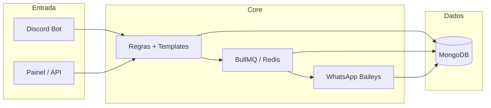

# RadarZap v2.0

> **Software proprietário** — Copyright (c) 2026 Benhur Augusto Gomes Monteiro Faria.  
> Ver [LICENSE.md](LICENSE.md) e [THIRD_PARTY_LICENSES.md](THIRD_PARTY_LICENSES.md).

Plataforma SaaS para **envio e automação de mensagens WhatsApp**, com módulo opcional de **Discord → WhatsApp** (captura em canais, regras, templates e fila).

Esta pasta é a **versão limpa 2.0** do projeto original (`radarzap`): microserviços TypeScript, painel React e sem scripts legados de teste/deploy (GCP, Railway, Oracle, `minimal-index`, etc.).

---

## O que o RadarZap faz

### Plataforma (uso diário da empresa)

| Recurso | Descrição |
|---------|-----------|
| **Envios** | Manual, campanhas, agendamentos e histórico |
| **Contatos** | CRUD, segmentos, grupos WhatsApp, import CSV/VCF |
| **Consentimento LGPD** | Pendentes, aceitos, recusados e bloqueados |
| **Automações** | Regras recorrentes (ex.: aniversário) com gatilhos |
| **WhatsApp** | Sessões, QR Code, fila do tenant, logs |
| **Integrações** | Chaves API, webhooks, playground e documentação OpenAPI |
| **Empresa** | Equipe, planos, permissões, segurança e backup |

Templates de mensagem da plataforma usam prefixo **`pw-*`**.

### Discord → WhatsApp (automação por servidor)

| Etapa | Descrição |
|-------|-----------|
| **Captura** | Bot lê mensagens, embeds e anexos nos canais monitorados |
| **Classificação** | Links Twitch, TikTok, YouTube, Kick — live, vídeo, short ou clipe |
| **Regras** | Filtro por canal, palavra-chave e tipo de conteúdo |
| **Templates `dw-*`** | Catálogo editável no painel (`dw-live`, `dw-video`, …) |
| **Fila** | BullMQ com delay e retentativas |
| **Envio** | WhatsApp via Baileys (texto, imagem, botões) |
| **Logs** | Pipeline rastreável (capture → render → send) |

O **nome do streamer** vem do handle na URL (ex.: `@mcjean7` no TikTok), não do autor da mensagem no Discord.

---

## Arquitetura



| Serviço | Responsabilidade |
|---------|------------------|
| `DiscordBotService` | Captura e comandos slash |
| `QueueProcessorService` | Processa fila de envios |
| `WhatsAppService` | Sessões Baileys e envio |
| `DashboardService` | API REST + WebSocket do painel (`:3001`) |
| `APIGateway` | Gateway HTTP auxiliar |
| Frontend Vite | Painel React (`:5174` em dev) |

Entry point local: `npm run dev` → `src/index.ts` (sobe todos os serviços).

---

## Painel web

**Desenvolvimento:** [http://localhost:5174](http://localhost:5174)  
**API do painel:** [http://localhost:3001/api](http://localhost:3001/api)

O menu está dividido em **três abas** (segmented control no topo da sidebar):

| Aba | Público | Conteúdo |
|-----|---------|----------|
| **Plataforma** | Cliente / empresa | Envios, contatos, WhatsApp, automações, API, empresa |
| **Discord** | Quem tem servidor vinculado | Automação Discord → WhatsApp |
| **Admin RadarZap** | Staff interno | Operação global, clientes, planos, sistema |

Mapa completo de menus e rotas: **[docs/MENUS-SISTEMA.md](docs/MENUS-SISTEMA.md)**  
Mapa técnico rota → componente: **[docs/MENU-PAGES-REGISTRY.md](docs/MENU-PAGES-REGISTRY.md)**

Rotas frequentes:

| Rota | Função |
|------|--------|
| `/dashboard` | Visão geral da conta |
| `/send` | Enviar agora |
| `/sessions` | Sessões WhatsApp e QR Code |
| `/platform/fila` | Fila de envio do tenant |
| `/integrations/playground` | Teste de API |
| `/settings#api-docs` | Documentação REST |
| `/discord` | Início Discord |
| `/discord/rules` | Regras Discord → WhatsApp |
| `/discord/templates` | Templates `dw-*` |
| `/admin/dashboard` | Dashboard global (staff) |

---

## Pré-requisitos

- **Node.js** 18+ e npm 8+
- **Docker Desktop** (MongoDB + Redis locais)
- **Bot Discord** — [Developer Portal](https://discord.com/developers/applications)
- **OAuth** — Discord (login painel) e Google (opcional, login Gmail)
- **WhatsApp** — número para parear via QR no painel

---

## Configuração rápida

```bash
git clone https://github.com/benhuragmf/radarzapv2.git
cd radarzapv2

cp .env.example .env
# Edite .env (veja tabela abaixo)

npm install
npm install --prefix src/services/web-dashboard/frontend

npm run seed:templates          # templates dw-* (Discord)
npm run seed:platform-templates # templates pw-* (Plataforma)
npm run register-commands       # opcional: slash commands (DISCORD_GUILD_ID)
```

---

## Desenvolvimento local

Use **somente a infra Docker** da v2. Não suba o stack completo nem o Docker do v1 em paralelo (evita bot duplicado e mensagens repetidas).

```bash
# Infra: Redis :6380 + Mongo :27017 (volumes radarzapv2_*)
npm run docker:infra

# Terminal 1 — backend, bot, fila, WhatsApp, API :3001
npm run dev

# Terminal 2 — frontend Vite :5174
npm run dashboard:frontend
```

Abra **[http://localhost:5174](http://localhost:5174)**.

Parar processos locais:

```bash
npm run dev:stop
docker compose down   # opcional: para Mongo/Redis
```

### Problemas comuns

| Sintoma | Solução |
|---------|---------|
| `ECONNREFUSED :6380` ou `:27017` | `npm run docker:infra` |
| Login OAuth falha | `FRONTEND_URL` deve ser `http://localhost:5174`; redirect no Discord/Google igual ao `.env` |
| Mensagens duplicadas | Não rode v1 + v2 nem dois `npm run dev` |
| WhatsApp não envia | Conectar sessão em `/sessions`; destino cadastrado e consentimento OK |

### Migrar banco do v1 (uma vez)

```bash
npm run migrate:v1-db
```

Copia dados do volume Mongo do projeto antigo para `radarzapv2_mongodb-data`. O v1 permanece só como referência de código.

---

## Variáveis de ambiente

Copie `.env.example` → `.env`. Principais variáveis:

| Variável | Descrição |
|----------|-----------|
| `DISCORD_TOKEN` | Token do bot |
| `DISCORD_CLIENT_ID` / `DISCORD_CLIENT_SECRET` | OAuth login painel |
| `DISCORD_GUILD_ID` | Opcional: registrar slash commands em um servidor |
| `MONGODB_URL` | Mongo local ou remoto |
| `REDIS_URL` | Ex.: `redis://localhost:6380` |
| `JWT_SECRET` / `SESSION_SECRET` | Sessão e tokens |
| `FRONTEND_URL` | URL do browser — **`http://localhost:5174`** em dev |
| `DASHBOARD_PORT` | API do painel (padrão **3001**) |
| `GOOGLE_CLIENT_ID` / `GOOGLE_CLIENT_SECRET` | Login Gmail (opcional) |
| `RADARZAP_SYSTEM_ADMIN_DISCORD_IDS` | IDs Discord com acesso Admin |
| `RADARZAP_SYSTEM_MODERATOR_DISCORD_IDS` | IDs com moderação limitada |

Redirects OAuth no portal Discord/Google:

```
{FRONTEND_URL}/auth/discord/callback
{FRONTEND_URL}/auth/google/callback
```

---

## Integrações API

Disponível em planos **Pro/Enterprise** (capabilities `api:key:create`, `api:logs:view`).

| Recurso | Endpoint |
|---------|----------|
| OpenAPI (JSON) | `GET /api/integrations/openapi` |
| Chaves | `GET/POST /api/integrations/api-keys` |
| Webhooks | `GET/POST /api/integrations/webhooks` |
| Playground | `POST /api/integrations/playground` |
| Limites do plano | `GET /api/integrations/rate-limit` |

Autenticação externa: header `X-API-Key: rz_…`. No painel, a sessão usa cookie.

Documentação interativa: **Integrações → Documentação** ou `/settings#api-docs`.

---

## Produção (Docker completo)

```bash
npm run build
docker compose up -d
```

Serviços típicos: `api-gateway`, `discord-bot`, `whatsapp-service`, `queue-processor`, `mongodb`, `redis`, `auto-setup`, `health-monitor`.

> Em **dev**, não use `docker compose up -d` completo — o serviço `auto-setup` pode subir um segundo bot.

---

## Scripts npm

| Script | Descrição |
|--------|-----------|
| `npm run dev` | Orquestrador local (todos os serviços) |
| `npm run dev:stop` | Encerra processos dev (PowerShell) |
| `npm run docker:infra` | Só Redis + MongoDB |
| `npm run docker:up` / `docker:down` | Stack Docker completo / parar |
| `npm run dashboard:frontend` | Vite do painel (:5174) |
| `npm run build` | Compila TypeScript → `dist/` |
| `npm start` | Produção (`dist/index.js`) |
| `npm run seed:templates` | Templates `dw-*` no Mongo |
| `npm run seed:platform-templates` | Templates `pw-*` no Mongo |
| `npm run update:templates` | Atualiza catálogo `dw-*` |
| `npm run register-commands` | Slash commands Discord |
| `npm run migrate:v1-db` | Migra Mongo v1 → v2 |
| `npm run clear:test` | Limpa filas/cache de teste |
| `npm test` | Jest |
| `npm run test:coverage` | Cobertura |
| `npm run lint` / `lint:fix` | ESLint |

---

## Testes

```bash
npm test
```

Cobertura relevante: classificação de links, templates de stream, captura Discord, variáveis de template, RBAC.

---

## Estrutura do repositório

```
radarzapv2/
├── src/
│   ├── index.ts                    # Entry point (dev / all-in-one)
│   ├── auth/                       # OAuth, sessão, RBAC
│   ├── config/                     # environment.ts
│   ├── constants/
│   │   ├── discord-whatsapp-templates.ts   # Catálogo dw-*
│   │   └── openapi-dashboard.ts            # Contrato REST integrações
│   ├── models/                     # Mongoose (User, Rule, Destination, …)
│   ├── utils/                      # Captura Discord, classificador, templates
│   └── services/
│       ├── discord-bot/
│       ├── whatsapp/
│       ├── queue/
│       ├── api-gateway/
│       ├── platform/               # Templates pw-*, automações
│       └── web-dashboard/
│           ├── DashboardService.ts # API REST + Socket.IO
│           └── frontend/           # React + Vite + Tailwind
│               └── src/lib/navConfig.ts
├── docker/
├── scripts/
├── docs/
├── docker-compose.yml
├── seed-templates.ts
├── seed-platform-templates.ts
└── start-dashboard.ts
```

---

## Documentação

| Arquivo | Conteúdo |
|---------|----------|
| [docs/MENUS-SISTEMA.md](docs/MENUS-SISTEMA.md) | Menus do painel (Plataforma / Discord / Admin) |
| [docs/MENU-PAGES-REGISTRY.md](docs/MENU-PAGES-REGISTRY.md) | Mapa rota → componente → API |
| [docs/RADARZAP-V2-MIGRACAO.md](docs/RADARZAP-V2-MIGRACAO.md) | Diferenças v1/v2 e dev local |
| [docs/CONTATOS-CSV-IMPORTACAO.md](docs/CONTATOS-CSV-IMPORTACAO.md) | Importação/exportação de contatos (CSV/VCF) |
| [LICENSE.md](LICENSE.md) | Licença proprietária |
| [THIRD_PARTY_LICENSES.md](THIRD_PARTY_LICENSES.md) | Licenças de bibliotecas open source |

---

## Referência ao projeto v1

Se algo falhar na v2, consulte o repositório original antes de reinventar código:

| | Caminho |
|---|--------|
| **v1 (referência)** | `../radarzap` ou `C:\Users\benhu\OneDrive\Área de Trabalho\Projetos\radarzap` |
| **v2 (este repo)** | `radarzapv2` |

Detalhes: [docs/RADARZAP-V2-MIGRACAO.md](docs/RADARZAP-V2-MIGRACAO.md).

### Removido na v2 (em relação ao v1)

- ~30 scripts `test-*.js`, `fix-*.js`, `debug-*` na raiz
- `minimal-index.ts`, `simple-index.ts`, `src/services/discord/` legado
- Configs GCP, Railway, Oracle, `.kiro/`
- Secrets reais no `.env.example` (apenas placeholders)

---

## Licença

Este projeto é **software proprietário e fechado**.

O código-fonte, estrutura, regras de negócio, integrações, bots, APIs, painéis,
design, banco de dados e documentação pertencem a **Benhur Augusto Gomes Monteiro Faria**
(projetos RadarZap / RadarGamer).

Nenhuma parte deste sistema pode ser copiada, distribuída, vendida, publicada,
modificada, sublicenciada ou reutilizada sem **autorização expressa por escrito**.

- Termos completos: [LICENSE.md](LICENSE.md)
- Bibliotecas open source usadas: [THIRD_PARTY_LICENSES.md](THIRD_PARTY_LICENSES.md)
