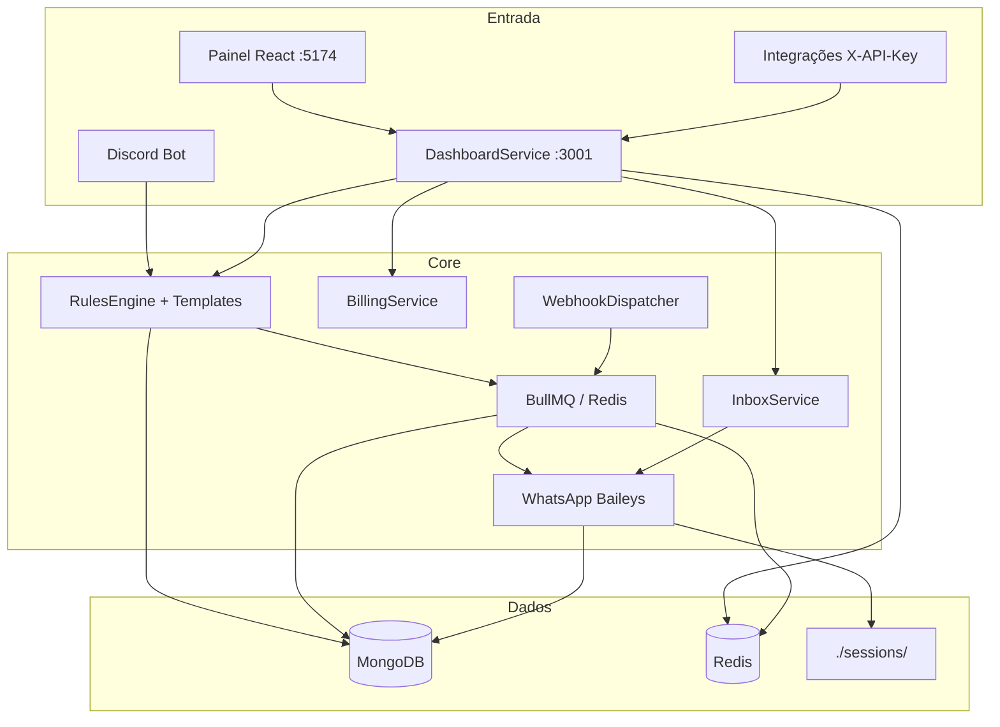

# RadarZap v2.5

> **Software proprietário** — Copyright (c) 2026 Benhur Augusto Gomes Monteiro Faria.  
> Ver [LICENSE.md](LICENSE.md) e [THIRD_PARTY_LICENSES.md](THIRD_PARTY_LICENSES.md).

Plataforma SaaS para **envio e automação de mensagens WhatsApp**, com módulo opcional de **Discord → WhatsApp** (captura em canais, regras, templates e fila), **Inbox de atendimento**, **billing Stripe** e **API REST** para integrações externas.

Esta pasta é a **versão limpa 2.x** do projeto original (`radarzap`): TypeScript monolítico em dev, painel React, Docker para infra/prod, sem scripts legados de teste/deploy (GCP, Railway, Oracle, `minimal-index`, etc.).

**Versão atual:** `2.12.2` · Changelog técnico: [docs/SISTEMA-REGISTRO.md](docs/SISTEMA-REGISTRO.md)

> **Documentação principal:** [docs/RADARZAP-SISTEMA-COMPLETO.md](docs/RADARZAP-SISTEMA-COMPLETO.md) · Índice: [docs/INDICE-DOCUMENTACAO.md](docs/INDICE-DOCUMENTACAO.md)

---

## Índice

1. [O que o RadarZap faz](#o-que-o-radarzap-faz)
2. [Arquitetura](#arquitetura)
3. [Boot da aplicação (`src/index.ts`)](#boot-da-aplicação-srcindexts)
4. [Serviços backend](#serviços-backend)
5. [Modelos de dados (MongoDB)](#modelos-de-dados-mongodb)
6. [Utilitários e engines](#utilitários-e-engines)
7. [Autenticação e RBAC](#autenticação-e-rbac)
8. [Painel web (frontend)](#painel-web-frontend)
9. [Scripts npm](#scripts-npm)
10. [Scripts em `/scripts`](#scripts-em-scripts)
11. [Docker e deploy](#docker-e-deploy)
12. [CI/CD e testes](#cicd-e-testes)
13. [Billing (Stripe)](#billing-stripe)
14. [Inbox e CSAT](#inbox-e-csat)
15. [Integrações API e webhooks](#integrações-api-e-webhooks)
16. [Variáveis de ambiente](#variáveis-de-ambiente)
17. [Desenvolvimento local](#desenvolvimento-local)
18. [Estrutura do repositório](#estrutura-do-repositório)
19. [Documentação complementar](#documentação-complementar)
20. [Referência ao v1](#referência-ao-projeto-v1)
21. [Licença](#licença)

---

## O que o RadarZap faz

### Plataforma (uso diário da empresa)

| Recurso | Descrição |
|---------|-----------|
| **Envios** | Manual, campanhas, agendamentos, status WhatsApp e histórico |
| **Contatos** | CRUD, segmentos, grupos WA, import/export CSV e VCF |
| **Consentimento LGPD** | Pendentes, aceitos, recusas progressivas e bloqueio manual |
| **Automações** | Regras recorrentes (ex.: aniversário) com gatilhos e horários |
| **Inbox** | Atendimento WhatsApp multi-setor, bot, tickets, CSAT pós-encerramento |
| **WhatsApp** | Sessões Baileys (QR), fila do tenant, logs, stories/status |
| **Integrações** | Chaves API (`X-API-Key`), webhooks outbound HMAC, playground, OpenAPI |
| **Billing** | Planos Free/Starter/Pro/Enterprise, checkout Stripe, portal de assinatura |
| **Empresa** | Equipe, papéis customizados, permissões, segurança, backup JSON do tenant |
| **Admin** | Operação global: orgs, planos, filas, logs, pagamentos, métricas API |

Templates da plataforma usam prefixo **`pw-*`**. Templates Discord usam **`dw-*`**.

### Discord → WhatsApp (automação por servidor)

| Etapa | Descrição |
|-------|-----------|
| **Captura** | Bot lê mensagens, embeds e anexos nos canais monitorados |
| **Classificação** | Links Twitch, TikTok, YouTube, Kick — live, vídeo, short ou clipe |
| **Regras** | Filtro por canal, palavra-chave e tipo de conteúdo |
| **Templates `dw-*`** | Catálogo editável (`dw-live`, `dw-video`, …) |
| **Fila** | BullMQ com delay configurável e retentativas |
| **Envio** | WhatsApp via Baileys (texto, imagem, botões) |
| **Logs** | Pipeline rastreável (capture → render → send) |

O **nome do streamer** vem do handle na URL (ex.: `@mcjean7` no TikTok), não do autor da mensagem no Discord.

---

## Arquitetura

### Modo recomendado: monolito

Em desenvolvimento e produção atual, um único processo Node sobe **todos** os subsistemas (`npm run dev` ou `node dist/index.js` **sem** `SERVICE_NAME`).



| Componente | Porta / local | Responsabilidade |
|------------|---------------|------------------|
| `DashboardService` | `:3001` | API REST, OAuth, Socket.IO, static do React em prod |
| Frontend Vite | `:5174` (dev) | Painel React + proxy `/api` → `:3001` |
| `DiscordBotService` | — | Gateway Discord, captura, slash commands |
| `QueueProcessorService` | — | Workers BullMQ (`message-processing`, `whatsapp-sending`, …) |
| `WhatsAppService` | — | Sessões Baileys, envio, reconexão, status/stories |
| `BillingService` | — | Stripe checkout, webhooks, expiração de plano |
| `WebhookDispatcherService` | — | Entrega assíncrona de webhooks outbound |
| `APIGateway` | `:3000` (opcional) | Gateway HTTP legado — não necessário no monolito |

> **Produção:** ver [docs/PREPARACAO-PRODUCAO.md](docs/PREPARACAO-PRODUCAO.md) — monolito Docker (`docker/Dockerfile.monolith`) ou PM2 + nginx. Atalho go-live: [docs/PRODUCTION.md](docs/PRODUCTION.md).

---

## Boot da aplicação (`src/index.ts`)

A classe `Application` orquestra a subida e o shutdown gracioso.

| Método / etapa | Função |
|----------------|--------|
| `validateConfig()` | Valida variáveis obrigatórias em `src/config/environment.ts` |
| `initializeInfrastructure()` | Conecta MongoDB, Redis, filas Bull, webhooks outbound e billing |
| `acquireDevInstanceLock()` | Impede dois `npm run dev` na mesma máquina (lock por porta) |
| `startServices()` | Sobe subsistemas conforme `SERVICE_NAME` (vazio = todos) |
| `startDiscordBot()` | Instancia `DiscordBotService` e conecta ao Gateway |
| `startWhatsAppService()` | Singleton `WhatsAppService` — sessões e envio |
| `startQueueProcessor()` | Registra processors nas filas Redis |
| `startAPIGateway()` | Gateway auxiliar (falha não fatal em dev) |
| `startDashboard()` | `DashboardService` na porta `DASHBOARD_PORT` (3001) |
| `setupGracefulShutdown()` | SIGTERM/SIGINT → para serviços, libera lock, fecha conexões |

**Variável `SERVICE_NAME`:** quando definida, sobe apenas um subsistema (ex.: `web-dashboard` só API, sem Baileys). Em produção monolito, **não definir**.

---

## Serviços backend

Cada serviço vive em `src/services/<nome>/`. Abaixo, o papel de cada um.

### `web-dashboard/DashboardService.ts`

**Coração da API.** Express + Socket.IO + sessão Redis + RBAC.

| Área | Função |
|------|--------|
| **Auth** | Rotas `/auth/discord`, `/auth/google`, cookie de sessão |
| **Tenant** | Campanhas, destinos, templates, automações, consentimento |
| **Inbox** | Conversas, mensagens, setores, bot, tickets, relatórios, CSAT |
| **WhatsApp** | Proxy para sessões, QR, status posts, logs WA |
| **Integrações** | API keys, webhooks, playground, OpenAPI JSON |
| **Billing** | `/billing/*`, checkout Stripe, confirmação pós-redirect |
| **Admin** | Orgs, planos, filas globais, logs, erros, pagamentos |
| **Backup** | `GET/POST /tenant-backup/export\|import` — JSON do tenant |
| **Cloud API stub** | `GET/POST /integrations/whatsapp/cloud/webhook` (Meta — pendente) |
| **Static** | Em prod, serve o build React de `web-dashboard/public/` |

### `discord-bot/DiscordBotService.ts`

| Função | Descrição |
|--------|-----------|
| Conexão Gateway | Login com `DISCORD_TOKEN`, intents de mensagens |
| `MessageExtractor` | Extrai texto, embeds, anexos e URLs de cada mensagem |
| Captura | Envia payload para `RulesEngine` quando canal está monitorado |
| `CommandHandler` | Slash commands (`/setup`, etc.) para vincular servidor |
| Eventos | Atualiza alertas de navegação no painel |

### `queue/QueueProcessorService.ts`

Processa jobs BullMQ:

| Fila | Função |
|------|--------|
| `message-processing` | Renderiza template e prepara payload de envio |
| `whatsapp-sending` | Chama `WhatsAppService` para entregar mensagem |
| `discord-monitoring` | Tarefas periódicas do bot |
| `session-cleanup` | Limpeza de sessões expiradas |
| `rate-limiting` | Controle de taxa por tenant |
| `notifications` | Webhooks outbound (`webhook-deliver`) |

### `whatsapp/WhatsAppService.ts`

| Função | Descrição |
|--------|-----------|
| Sessões Baileys | QR Code, credenciais criptografadas, reconexão automática |
| Envio | Texto, mídia, botões, listas — conforme `MessageFormatter` |
| Status/Stories | Publicação e agendamento via `StatusDispatchService` |
| Eventos | `session.connected` / `disconnected` → webhooks + alertas Slack |
| Inbox | Entrega mensagens inbound para `InboxService` |
| Perfil | Sincronização de foto de perfil dos contatos |

### `rules/RulesEngine.ts`

| Função | Descrição |
|--------|-----------|
| Avalia regras | Canal Discord, keywords, tipo de link classificado |
| Seleciona template | `dw-*` conforme classificação (live, video, …) |
| Enfileira | Cria job em `message-processing` com delay e destinos |
| Bloqueio de grupo | `RuleGroupBlockService` — evita spam em grupos WA |

### `send/CampaignDispatchService.ts`

| Função | Descrição |
|--------|-----------|
| Campanhas | Disparo em massa para destinos/grupos com validação prévia |
| Agendamento | Integra com `automation-schedule` e fila |
| Webhooks | Dispara `campaign.sent` / `campaign.failed` ao concluir |

### `inbox/InboxService.ts`

| Função | Descrição |
|--------|-----------|
| Conversas | Abertura, atribuição, transferência, encerramento |
| Bot | Respostas automáticas, triagem por setor, horário comercial |
| CSAT | Pesquisa 1–5 após encerramento (`csat.util.ts`) |
| Inatividade | Auto-fechamento por timeout (`inbox-inactivity.ts`) |
| Realtime | Socket.IO via `InboxRealtime` e `PanelNotifications` |
| Tickets | Chamados internos da equipe (`InboxTicket`) |

### `billing/BillingService.ts`

| Função | Descrição |
|--------|-----------|
| Checkout | Cria sessão Stripe Checkout para Starter/Pro |
| Webhook Stripe | `POST /api/billing/webhook/stripe` — HMAC raw body |
| Assinatura | Atualiza `Organization.plan`, limites e expiração |
| Pedidos | Persiste `BillingOrder` para histórico admin |

### `integrations/WebhookDispatcherService.ts`

| Função | Descrição |
|--------|-----------|
| Registro | Escuta fila `notifications` |
| Entrega | POST HTTPS com `X-RadarZap-Signature` (HMAC-SHA256) |
| Retry | Backoff exponencial — ver [docs/WEBHOOKS.md](docs/WEBHOOKS.md) |

### `tenant-backup/TenantBackupService.ts`

| Função | Descrição |
|--------|-----------|
| `exportOrganization()` | JSON com destinos, grupos, inbox, regras, templates — **sem** secrets de API/webhook |
| `importOrganization()` | Restaura dados; opção `replace` para sobrescrever |

### `consent/ConsentService.ts`

| Função | Descrição |
|--------|-----------|
| Status LGPD | `waiting`, `accepted`, recusas progressivas, `blocked` |
| Renovação | Fluxo de aprovação de re-consentimento |
| Webhook | `consent.updated` em mudanças de status |

### `destinations/*`

| Arquivo | Função |
|---------|--------|
| `DestinationManager` | CRUD de contatos e grupos WhatsApp |
| `contactCsvImportService` | Import CSV/VCF com dry-run |
| `contactCsvExportService` | Export com perfis (Google-compatible, etc.) |
| `DestinationHealthService` | Saúde do destino, alertas de consentimento |
| `DestinationSyncService` | Sincroniza grupos WA com Mongo |

### `platform/BirthdayAutomationService.ts`

Executa automações `pw-*` de aniversário: match por data/tags, envio via fila.

### `email/EmailService.ts`

Envio de convites de equipe (Resend ou SMTP) — `team-invite-email.ts`.

### `alerts/AlertNotificationService.ts`

Notifica Slack (`ALERT_SLACK_WEBHOOK_URL`) quando sessão WhatsApp desconecta.

### `organization/OrganizationService.ts`

CRUD de organizações, troca de contexto no painel, limites por plano.

### `api-gateway/APIGateway.ts`

Gateway HTTP legado (porta `API_PORT`). No monolito atual, a API principal é o `DashboardService`.

### `monitoring/*`

| Arquivo | Função |
|---------|--------|
| `MetricsCollector` | Métricas de filas e serviços |
| `LogManager` | Persistência de `SystemLog` |
| `bullBoard.ts` | UI Bull Board (admin) |

---

## Modelos de dados (MongoDB)

Coleções Mongoose em `src/models/`.

| Modelo | Função |
|--------|--------|
| `Organization` | Tenant: plano, limites, `roleCapabilities`, `customRoles` |
| `User` | Usuário global (Discord/Google), vínculo com orgs |
| `CompanyMember` | Membro da equipe: papel, capabilities extras/negadas |
| `Destination` | Contato ou grupo WA: telefone, consentimento, segmentos |
| `ContactGroup` | Listas/segmentos de contatos |
| `Rule` | Regra Discord → WA: canal, keywords, template, delay |
| `Template` | Template `dw-*` customizado por guild |
| `PlatformTemplate` | Template `pw-*` da plataforma |
| `DiscordChannel` | Canais monitorados por guild |
| `MessageQueue` | Histórico de mensagens na fila (auditoria) |
| `WhatsAppSession` | Metadados de sessão Baileys por org |
| `StatusPost` | Status/stories agendados ou publicados |
| `BirthdayAutomationRule` | Regra de aniversário com tags e horário |
| `InboxSettings` | Config do bot: horários, CSAT, mensagens padrão |
| `InboxDepartment` | Setor de atendimento e membros |
| `InboxConversation` | Conversa WA: status, assignee, CSAT pending/score |
| `InboxMessage` | Mensagens inbound/outbound do inbox |
| `InboxTransfer` | Histórico de transferências entre setores |
| `InboxTicket` | Ticket interno da equipe |
| `ConsentHistory` | Auditoria de mudanças de consentimento |
| `ConsentRenewalRequest` | Pedido de renovação LGPD pendente |
| `ConsentPoll` | Enquete de consentimento (legado/auxiliar) |
| `ApiKey` | Chave de integração (`rz_…`, hash, capabilities) |
| `WebhookEndpoint` | URL, eventos, secret HMAC |
| `BillingOrder` | Pedido/checkout Stripe |
| `AuditLog` | Auditoria de ações sensíveis |
| `SystemLog` | Logs estruturados do sistema |
| `GuildMembership` | Vínculo usuário ↔ servidor Discord |

---

## Utilitários e engines

| Módulo | Função |
|--------|--------|
| `utils/link-content-classifier.ts` | Classifica URL (Twitch live, TikTok video, YouTube short, …) |
| `utils/discord-capture.ts` | Normaliza payload capturado do Discord |
| `utils/discord-wa-variables.ts` | Variáveis `{{streamer}}`, `{{url}}` nos templates `dw-*` |
| `utils/platform-wa-variables.ts` | Variáveis nos templates `pw-*` |
| `services/templates/TemplateEngine.ts` | Renderiza templates com variáveis e condicionais |
| `utils/contact-csv-import.ts` | Parser CSV de contatos |
| `utils/contact-vcf-import.ts` | Parser VCF (vCard) |
| `utils/whatsapp-phone.ts` | Normalização E.164 |
| `utils/automation-schedule.ts` | Cálculo de próximo disparo (cron-like) |
| `utils/webhook-signature.ts` | Assina e verifica HMAC dos webhooks outbound |
| `utils/dev-instance-lock.ts` | Lock de instância única em dev |
| `utils/GracefulShutdown.ts` | Encerramento ordenado de serviços |
| `cache/QueueManager.ts` | Singleton das filas BullMQ |
| `cache/RedisManager.ts` | Cliente Redis (sessão, cache, filas) |
| `database/DatabaseManager.ts` | Conexão Mongoose |

---

## Autenticação e RBAC

### Login

| Provedor | Quem usa | Callback |
|----------|----------|----------|
| **Google OAuth** | Dono da empresa (Gmail) | `{FRONTEND_URL}/auth/google/callback` |
| **Discord OAuth** | Equipe / operadores | `{FRONTEND_URL}/auth/discord/callback` |

Sessão: cookie `connect.sid` no Redis (`express-session` + `connect-redis`).

### Capabilities (`src/auth/rbac/capabilities.ts`)

Autorização **por ação**, não só por papel. Exemplos:

| Capability | Permite |
|------------|---------|
| `whatsapp:session:manage` | Conectar/desconectar sessão WA |
| `send:schedule:manage` | Criar campanhas e agendamentos |
| `inbox:reply` | Responder conversas no Inbox |
| `inbox:department:manage` | Configurar bot, setores, CSAT |
| `api:key:create` | Gerar chaves de API |
| `billing:manage` | Checkout e import de backup |
| `system:moderation:action` | Admin: listar orgs, alterar planos |
| `system:payments:view` | Admin: pedidos Stripe |

Papéis preset (`OWNER`, `ADMIN`, `OPERATOR`, …) e papéis custom (`custom:uuid`) mapeiam para subsets de capabilities. Detalhes: [docs/EQUIPE-RBAC.md](docs/EQUIPE-RBAC.md).

---

## Painel web (frontend)

**Dev:** [http://localhost:5174](http://localhost:5174) · **API:** [http://localhost:3001/api](http://localhost:3001/api)

### Três modos de navegação (`navConfig.ts`)

| Modo | Público | Exemplos de rota |
|------|---------|------------------|
| **Plataforma** | Cliente / empresa | `/send`, `/platform/inbox`, `/plans` |
| **Discord** | Servidor vinculado | `/discord`, `/discord/rules` |
| **Admin** | Staff RadarZap | `/admin/moderation`, `/admin/api` |

### Arquivos-chave do frontend

| Arquivo | Função |
|---------|--------|
| `src/lib/api.ts` | Cliente HTTP — prefixo `/api`, credentials cookie |
| `src/lib/auth.ts` | Login/logout, estado do usuário |
| `src/lib/navConfig.ts` | Menu, títulos, permissões por rota |
| `src/hooks/useInboxSocket.ts` | WebSocket do Inbox em tempo real |
| `src/hooks/usePanelSocket.ts` | Eventos globais do painel |
| `src/components/layout/Layout.tsx` | Shell: sidebar, header, safe-area mobile |
| `vite.config.ts` | Proxy `/api` → `:3001`, build → `../public/` |

Mapa completo: [docs/MENU-PAGES-REGISTRY.md](docs/MENU-PAGES-REGISTRY.md) · Menus UX: [docs/MENUS-SISTEMA.md](docs/MENUS-SISTEMA.md)

---

## Scripts npm

Todos os scripts definidos em `package.json` e sua função.

### Desenvolvimento

| Script | Função |
|--------|--------|
| `npm run dev` | Sobe monolito com hot-reload (`ts-node-dev`): Mongo, Redis, bot, filas, WA, API `:3001` |
| `npm run dev:stop` | Mata processos Node do dev no Windows (`scripts/stop-dev.ps1`) |
| `npm run dashboard:frontend` | Vite dev server do painel em `:5174` |
| `npm run dashboard` | Sobe só `DashboardService` via `start-dashboard.ts` (sem bot/WA) |

### Build e produção

| Script | Função |
|--------|--------|
| `npm run build` | Compila TypeScript (`tsc`) + resolve aliases (`tsc-alias`) → `dist/` |
| `npm start` | Executa `node dist/index.js` (produção) |
| `npm run setup` | `build` + `docker-compose build` (legado microserviços) |
| `npm run deploy` | `test` + `build` + `docker:up` (legado) |

### Docker

| Script | Função |
|--------|--------|
| `npm run docker:infra` | Só Mongo `:27017` + Redis `:6380` — **use em dev** |
| `npm run docker:prod` | Monolito prod: `docker-compose.prod.yml` (app + mongo + redis) |
| `npm run docker:up` | Stack completo legado (`docker-compose.yml`) — **evitar em dev** |
| `npm run docker:down` | Para containers do compose |
| `npm run docker:build` | Build imagens do compose legado |
| `npm run docker:logs` | Follow dos logs Docker |

### Seeds e manutenção

| Script | Função |
|--------|--------|
| `npm run seed:templates` | Insere catálogo `dw-*` (Discord) no Mongo |
| `npm run seed:platform-templates` | Insere catálogo `pw-*` (Plataforma) no Mongo |
| `npm run update:templates` | Atualiza templates `dw-*` existentes |
| `npm run register-commands` | Registra slash commands no `DISCORD_GUILD_ID` |
| `npm run migrate:v1-db` | Copia volume Mongo do projeto v1 → v2 |
| `npm run clear:test` | Limpa filas Bull, dedup Redis e filas pendentes no Mongo |

### Stripe (billing dev)

| Script | Função |
|--------|--------|
| `npm run stripe:prices` | Cria prices R$ 99 / R$ 299 na conta Stripe teste |
| `npm run stripe:webhook` | Inicia `stripe listen` encaminhando para webhook local |

### Testes e qualidade

| Script | Função |
|--------|--------|
| `npm test` | Jest — testes unitários e de integração |
| `npm run test:watch` | Jest em modo watch |
| `npm run test:coverage` | Jest com relatório de cobertura |
| `npm run test:e2e:install` | Baixa Chromium do Playwright (manual) |
| `npm run test:e2e` | Playwright — login + PWA (roda `pretest:e2e` antes) |
| `npm run test:e2e:ui` | Playwright UI mode (debug visual) |
| `npm run lint` | ESLint em `src/**/*.ts` |
| `npm run lint:fix` | ESLint com auto-fix |

---

## Scripts em `/scripts`

| Arquivo | Função |
|---------|--------|
| `register-dev-logging.cjs` | Formata logs coloridos no `npm run dev` |
| `stop-dev.ps1` | Encerra processos dev (Windows) |
| `clear-dev-lock.cjs` | Remove lock de instância dev travado |
| `migrate-v1-db-to-v2.ps1` | Migração de dados Mongo v1 → v2 |
| `clear-test-state.ts` | Reset de filas/cache para testes limpos |
| `create-stripe-radarzap-prices.ts` | Cria produtos/prices Stripe RadarZap |
| `stripe-webhook-dev.ps1` | Wrapper Stripe CLI para webhook local |
| `deploy-remote.sh` | No servidor: `docker pull` + `compose up` + health check |
| `mongo-init.js` | Init do Mongo no Docker (usuário admin) |
| `setup.js` | Setup inicial legado |
| `test-profile-picture-sync.ts` | Script de diagnóstico WA (dev) |

---

## Docker e deploy

| Arquivo | Função |
|---------|--------|
| `docker-compose.yml` | Stack **legado** microserviços — não usar em dev |
| `docker-compose.prod.yml` | Monolito + Mongo + Redis (build local) |
| `docker-compose.deploy.yml` | Monolito com imagem GHCR (`RADARZAP_IMAGE`) |
| `docker/Dockerfile.monolith` | Multi-stage: frontend Vite + backend TS → imagem única |

**Deploy automático:** GitHub Actions `.github/workflows/deploy.yml` — build → GHCR → SSH. Secrets: `DEPLOY_HOST`, `DEPLOY_USER`, `DEPLOY_SSH_KEY`, `DEPLOY_PATH`, `MONGO_PASSWORD`. Guia: [docs/PREPARACAO-PRODUCAO.md](docs/PREPARACAO-PRODUCAO.md).

---

## CI/CD e testes

Workflow `.github/workflows/ci.yml`:

| Job | Função |
|-----|--------|
| `test` | Jest (exclui testes instáveis de WA/VCF) |
| `backend-build` | `npm run build` — verifica TypeScript |
| `frontend-build` | `vite build` do painel |
| `e2e` | Playwright smoke (login + manifest PWA) |

```bash
# Local
npm test
npm run test:e2e        # primeira vez baixa Chromium automaticamente
```

Cobertura relevante: classificador de links, templates, CSAT, billing, webhooks, RBAC, captura Discord.

---

## Billing (Stripe)

| Plano | Preço (referência) | Limites principais |
|-------|-------------------|-------------------|
| **Free** | R$ 0 | Uso básico, sem API |
| **Starter** | R$ 99/mês | Envios e automações essenciais |
| **Pro** | R$ 299/mês | API keys, webhooks, limites maiores |
| **Enterprise** | Contrato | Cloud API Meta (futuro), limites custom |

Catálogo: `config/plans.json` · Serviço: `PlanConfigService` · Doc: [docs/BILLING.md](docs/BILLING.md)

Fluxo: `/plans` → checkout Stripe → webhook atualiza `Organization` → limites aplicados em tempo real.

---

## Inbox e CSAT

Módulo de atendimento WhatsApp integrado ao Baileys.

| Recurso | Rota / API |
|---------|------------|
| Conversas | `GET/POST /api/inbox/conversations` |
| Mensagens | `POST /api/inbox/conversations/:id/messages` |
| Setores | `GET/POST/PATCH /api/inbox/departments` |
| Bot / CSAT | `GET/PATCH /api/inbox/settings` |
| Tickets | `GET/POST /api/inbox/tickets` |
| Relatórios | `GET /api/inbox/reports` |

**Tickets assíncronos (v2.5.2):** após fechamento ou envio da equipe, o cliente pode responder por **12h**; complementos na mesma rodada têm **30 min**; após **2h** sem interação, menu com `sair` / `finalizar` ou novo atendimento.

**CSAT (v2.5):** após encerrar conversa, cliente recebe pesquisa 1–5; resposta grava `csatScore` e dispara webhook `inbox.csat.rated`.

Doc completa: [docs/INBOX-ATENDIMENTO.md](docs/INBOX-ATENDIMENTO.md)

---

## Integrações API e webhooks

Base: `/api` · Auth externa: header `X-API-Key: rz_…`

| Endpoint | Função |
|----------|--------|
| `GET /integrations/openapi` | Contrato OpenAPI JSON |
| `GET/POST /integrations/api-keys` | Gerenciar chaves |
| `GET/POST/PATCH/DELETE /integrations/webhooks` | Endpoints de webhook |
| `POST /integrations/playground` | Teste de envio autenticado |
| `GET /integrations/rate-limit` | Uso vs. limites do plano |

Eventos webhook: [docs/WEBHOOKS.md](docs/WEBHOOKS.md)

---

## Variáveis de ambiente

Copie `.env.example` → `.env`.

### Essenciais (dev)

| Variável | Função |
|----------|--------|
| `DISCORD_TOKEN` | Token do bot Discord |
| `DISCORD_CLIENT_ID` / `SECRET` | OAuth login painel |
| `MONGODB_URL` | Connection string Mongo |
| `REDIS_URL` | Ex.: `redis://localhost:6380` |
| `JWT_SECRET` / `SESSION_SECRET` | Tokens e cookie de sessão |
| `SESSION_ENCRYPTION_KEY` | Criptografia credenciais Baileys — **não rotacionar** com WA conectado |
| `FRONTEND_URL` | `http://localhost:5174` em dev |
| `DASHBOARD_PORT` | API do painel (padrão `3001`) |

### OAuth Google (dono)

| Variável | Função |
|----------|--------|
| `GOOGLE_CLIENT_ID` / `SECRET` | Login Gmail |

### Admin interno

| Variável | Função |
|----------|--------|
| `RADARZAP_SYSTEM_ADMIN_DISCORD_IDS` | IDs com acesso Admin completo |
| `RADARZAP_SYSTEM_MODERATOR_DISCORD_IDS` | IDs com moderação limitada |

### Billing

| Variável | Função |
|----------|--------|
| `STRIPE_SECRET_KEY` | `sk_test_` ou `sk_live_` |
| `STRIPE_WEBHOOK_SECRET` | `whsec_…` do Stripe CLI ou dashboard |
| `STRIPE_PRICE_ID_STARTER` / `PRO` | IDs dos prices — `npm run stripe:prices` |
| `ALLOW_DEV_BILLING` | `true` só em dev local |

### Alertas e e-mail

| Variável | Função |
|----------|--------|
| `ALERT_SLACK_WEBHOOK_URL` | Alerta quando WA desconecta |
| `RESEND_API_KEY` / `SMTP_*` | Convites de equipe |

### Cloud API Meta (futuro)

| Variável | Função |
|----------|--------|
| `META_APP_ID` / `META_APP_SECRET` | App Meta Business |
| `WHATSAPP_CLOUD_VERIFY_TOKEN` | Verificação webhook GET |
| `WHATSAPP_DEFAULT_CHANNEL` | `baileys` (padrão) ou `cloud` |

Lista completa: `.env.example` · Servidor/deploy: [docs/PREPARACAO-PRODUCAO.md](docs/PREPARACAO-PRODUCAO.md)

---

## Desenvolvimento local

Use **somente** `npm run docker:infra` para infra. Não suba o stack completo nem o v1 em paralelo.

```bash
git clone https://github.com/benhuragmf/radarzapv2.git
cd radarzapv2
cp .env.example .env
# Edite .env

npm install
npm install --prefix src/services/web-dashboard/frontend
npm run seed:templates
npm run seed:platform-templates

# Terminal 1 — infra
npm run docker:infra

# Terminal 2 — backend monolito
npm run dev

# Terminal 3 — frontend
npm run dashboard:frontend
```

Abra **[http://localhost:5174](http://localhost:5174)**.

### Problemas comuns

| Sintoma | Solução |
|---------|---------|
| `ECONNREFUSED :6380` / `:27017` | `npm run docker:infra` |
| Login OAuth falha | `FRONTEND_URL=http://localhost:5174`; redirect igual no Discord/Google |
| Mensagens duplicadas | Não rode v1 + v2 nem dois `npm run dev` |
| WhatsApp não envia | Conectar em `/sessions`; destino com consentimento OK |
| `test:e2e` falha no browser | `npx playwright install chromium` (ou `npm run test:e2e` com `pretest:e2e`) |
| Billing local | `npm run stripe:webhook` + `ALLOW_DEV_BILLING=true` |

---

## Estrutura do repositório

```
radarzapv2/
├── src/
│   ├── index.ts                 # Entry point — classe Application
│   ├── auth/                      # OAuth, sessão, RBAC (capabilities, roles)
│   ├── config/                    # environment.ts, billing-env.ts
│   ├── constants/                 # Templates dw-*, openapi-dashboard, inbox-triage
│   ├── database/                  # DatabaseManager (Mongoose)
│   ├── cache/                     # RedisManager, QueueManager, SessionCache
│   ├── middleware/                # security, rateLimiter
│   ├── models/                    # Schemas Mongoose (32 coleções)
│   ├── types/                     # Tipos compartilhados (inbox, contact-fields, …)
│   ├── utils/                     # Classificador, captura, CSV, webhook HMAC, …
│   └── services/
│       ├── discord-bot/           # Bot + MessageExtractor + CommandHandler
│       ├── whatsapp/              # Baileys, MessageFormatter, status
│       ├── queue/                 # QueueProcessorService
│       ├── rules/                 # RulesEngine
│       ├── send/                  # Campanhas e status dispatch
│       ├── inbox/                 # InboxService, CSAT, inatividade, relatórios
│       ├── billing/               # Stripe, planos, expiração
│       ├── consent/               # LGPD
│       ├── destinations/          # Contatos, CSV, saúde
│       ├── integrations/          # WebhookDispatcher
│       ├── platform/              # Templates pw-*, aniversário
│       ├── organization/          # Org, exclusão
│       ├── tenant-backup/         # Export/import JSON
│       ├── alerts/                # Slack
│       ├── email/                 # Convites
│       ├── monitoring/            # Logs, métricas, Bull Board
│       ├── api-gateway/           # Gateway legado
│       └── web-dashboard/
│           ├── DashboardService.ts  # API REST principal
│           └── frontend/            # React + Vite + Tailwind 4
├── config/
│   └── plans.json               # Catálogo de planos
├── docker/                      # Dockerfiles (monolith, legado)
├── scripts/                     # Utilitários CLI (deploy, stripe, migrate, …)
├── e2e/                         # Testes Playwright
├── docs/                        # Documentação técnica
├── .github/workflows/           # CI + Deploy
├── docker-compose*.yml
├── seed-templates.ts
├── seed-platform-templates.ts
├── playwright.config.ts
└── package.json
```

---

## Documentação complementar

| Arquivo | Conteúdo |
|---------|----------|
| [docs/MENUS-SISTEMA.md](docs/MENUS-SISTEMA.md) | Menus UX (Plataforma / Discord / Admin) |
| [docs/MENU-PAGES-REGISTRY.md](docs/MENU-PAGES-REGISTRY.md) | Mapa rota → componente → API |
| [docs/RADARZAP-V2-MIGRACAO.md](docs/RADARZAP-V2-MIGRACAO.md) | Diferenças v1/v2 |
| [docs/PREPARACAO-PRODUCAO.md](docs/PREPARACAO-PRODUCAO.md) | Servidor, deploy, staging, prod, smoke, rollback, Cloud API |
| [docs/PRODUCTION.md](docs/PRODUCTION.md) | Atalho go-live → aponta para PREPARACAO-PRODUCAO |
| [docs/BILLING.md](docs/BILLING.md) | Stripe, webhooks, planos |
| [docs/WEBHOOKS.md](docs/WEBHOOKS.md) | Webhooks outbound e eventos |
| [docs/INBOX-ATENDIMENTO.md](docs/INBOX-ATENDIMENTO.md) | Inbox, tickets assíncronos (12h / `sair`), setores, bot, CSAT |
| [docs/EQUIPE-RBAC.md](docs/EQUIPE-RBAC.md) | Papéis e capabilities |
| [docs/CONSENTIMENTO-LGPD.md](docs/CONSENTIMENTO-LGPD.md) | Fluxo de consentimento |
| [docs/CONTATOS-CSV-IMPORTACAO.md](docs/CONTATOS-CSV-IMPORTACAO.md) | Import/export contatos |
| [docs/ROADMAP-COMPLETUDE.md](docs/ROADMAP-COMPLETUDE.md) | Lacunas e prioridades |
| [docs/SISTEMA-REGISTRO.md](docs/SISTEMA-REGISTRO.md) | Changelog técnico por versão |
| [SECURITY.md](SECURITY.md) | Política de segurança e reporte de vulnerabilidades |
| [SECURITY_AUDIT.md](SECURITY_AUDIT.md) | Auditoria de segurança (jun/2026) |
| [SECURITY_CHECKLIST.md](SECURITY_CHECKLIST.md) | Checklist pré-deploy |

---

## Referência ao projeto v1

Se algo falhar na v2, consulte o repositório original antes de reinventar código:

| | Caminho |
|---|--------|
| **v1 (referência)** | `../radarzap` |
| **v2 (este repo)** | `radarzapv2` |

### Removido na v2

- ~30 scripts `test-*.js`, `fix-*.js` na raiz do v1
- `minimal-index.ts`, `simple-index.ts`
- Configs GCP, Railway, Oracle
- Secrets reais no `.env.example`

---

## Licença

Este projeto é **software proprietário e fechado**.

O código-fonte, estrutura, regras de negócio, integrações, bots, APIs, painéis, design, banco de dados e documentação pertencem a **Benhur Augusto Gomes Monteiro Faria** (projetos RadarZap / RadarGamer).

Nenhuma parte deste sistema pode ser copiada, distribuída, vendida, publicada, modificada, sublicenciada ou reutilizada sem **autorização expressa por escrito**.

- Termos completos: [LICENSE.md](LICENSE.md)
- Bibliotecas open source: [THIRD_PARTY_LICENSES.md](THIRD_PARTY_LICENSES.md)
