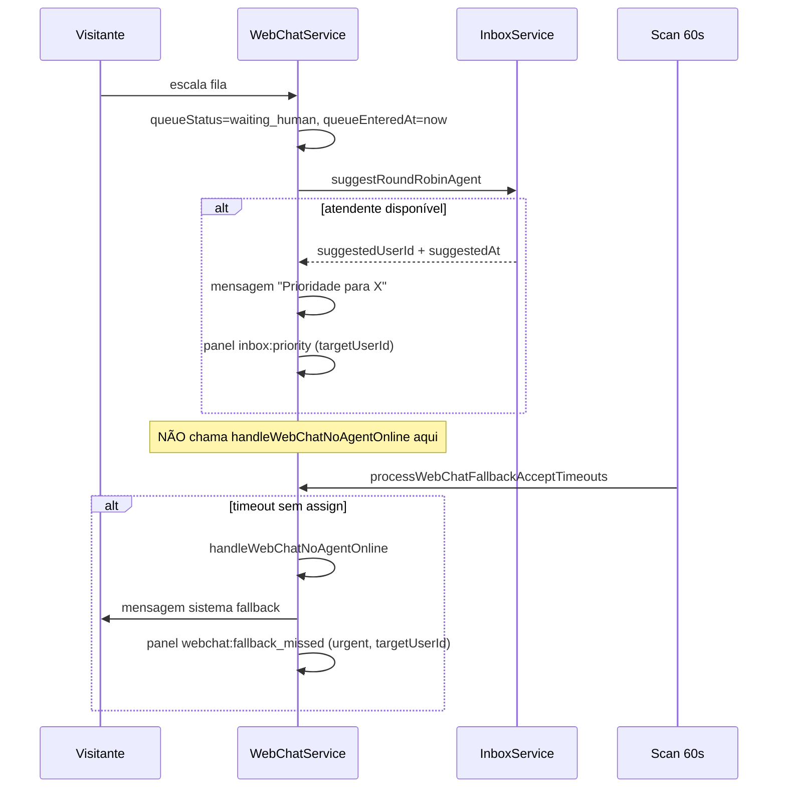

# Entrega atendimento 2.11.24–2.11.28 — referência completa

**Versão produto:** `2.11.28` · **Data doc:** 2026-06-21  
**Escopo:** supervisão avançada, presença operacional, fallback WhatsApp deferido, notificações críticas no painel, fix IA Básica WebChat.

Documento **técnico e operacional** — cada comportamento, campo, rota, evento e arquivo. Complementa (não substitui) [`INBOX-ATENDIMENTO.md`](./INBOX-ATENDIMENTO.md) e [`WEBCHAT.md`](./WEBCHAT.md).

---

## Índice

1. [Mapa de versões](#1-mapa-de-versões)
2. [2.11.24 — Supervisão avançada](#2-21124--supervisão-avançada)
3. [2.11.25 — Presença operacional](#3-21125--presença-operacional)
4. [2.11.28 — Fallback WhatsApp deferido](#4-21128--fallback-whatsapp-deferido)
5. [2.11.28 — Notificações críticas (sino vermelho)](#5-21128--notificações-críticas-sino-vermelho)
6. [2.11.28 — Fix IA Básica WebChat](#6-21128--fix-ia-básica-webchat)
7. [API REST](#7-api-rest)
8. [Socket.IO](#8-socketio)
9. [Frontend (painel)](#9-frontend-painel)
10. [Scans periódicos (~60s)](#10-scans-periódicos-60s)
11. [Testes automatizados](#11-testes-automatizados)
12. [Configuração no painel](#12-configuração-no-painel)
13. [Arquivos alterados](#13-arquivos-alterados)
14. [QA manual — roteiros](#14-qa-manual--roteiros)

---

## 1. Mapa de versões

| Versão | Entrega | Doc módulo |
|--------|---------|------------|
| **2.11.24** | Dashboard supervisor unificado WA + WebChat; monitor drawer; métricas 7d; reassign `wc:` | `INBOX-ATENDIMENTO.md` § Supervisor |
| **2.11.25** | Status operacional atendentes; round-robin por disponibilidade real; API presença | `INBOX-ATENDIMENTO.md` § Presença |
| **2.11.28** | Fallback deferido (`whatsappFallbackAcceptTimeoutSeconds`) | `WEBCHAT.md` § Fallback |
| **2.11.28** | Sino vermelho — plano, cota IA/mensagens, config, operacional | `BILLING.md` § Alertas |
| **2.11.28** | `WebChatBasicTriageService` não cai no menu robotizado | `RADARZAP-MODOS-ATENDIMENTO-IMPLEMENTACAO.md` |

---

## 2. 2.11.24 — Supervisão avançada

### Objetivo

Dar ao gestor (OWNER/ADMIN com `inbox:supervise`) visão **ao vivo** da equipe, filas unificadas WhatsApp + WebChat, conversas em andamento com monitor somente leitura e métricas rolling de 7 dias.

### Painel

| Item | Detalhe |
|------|---------|
| Rota | `/platform/inbox/supervisor` |
| Componente | `frontend/src/pages/menu/InboxSupervisor.tsx` |
| Drawer monitor | `SupervisorMonitorDrawer.tsx` — timeline read-only |
| Permissão | `inbox:supervise` |

### API

| Método | Rota | Resposta |
|--------|------|----------|
| GET | `/api/inbox/supervisor/dashboard` | `SupervisorDashboardPayload` — ver tipos abaixo |
| GET | `/api/inbox/supervisor/queue` | Fila ao vivo (legado; dashboard já inclui fila) |
| POST | `/api/inbox/conversations/:id/reassign` | `{ mode: 'suggest' \| 'assign', userId? }` — aceita ID `wc:{mongoId}` |

### Payload `SupervisorDashboardPayload`

Definido em `src/types/inbox-supervisor.ts`:

| Campo | Conteúdo |
|-------|----------|
| `generatedAt` | ISO timestamp |
| `periodDays` | `7` (constante `PERIOD_DAYS`) |
| `summary` | Contagens: fila, triagem, ativos, agentes online, prioridades, TMA médio, tempo puxar fila, CSAT médio |
| `agents[]` | Uma linha por membro elegível à fila — presença + atividade + métricas individuais |
| `activeConversations[]` | WA `in_progress` + WebChat `in_progress` |
| `queue[]` | WA `waiting_queue`/`bot_triage` + WebChat `waiting_queue`/`bot_triage` |

Cada conversa ativa/fila inclui: canal, contato, setor, assignee, sugerido, bridge WA, preview última msg, tempos (`handleTimeSec`, `queueWaitSec`), `ticketRef` se houver.

### Atividade do agente (`resolveAgentActivity`)

Heurística em `inbox-agent-presence.ts`:

| `SupervisorAgentActivity` | Condição |
|---------------------------|----------|
| `offline` | Sem heartbeat válido |
| `supervisor` | Status `supervisor_online` ou rota contém `/platform/inbox/supervisor` |
| `idle` | Status `ausente` |
| `other_page` | Status `ocupado` ou rota `/platform`/`/settings`/`/admin` fora do Inbox |
| `in_chat` | `viewingConversationId` no heartbeat ou conversas ativas assignadas |
| `inbox` | Rota contém `/platform/inbox` |

### Métricas por agente (7 dias)

Fonte: `InboxConversation` + `WebChatConversation` com `assignedUserId` no período.

| Métrica | Cálculo |
|---------|---------|
| `conversationsHandled` | Contagem de conversas assignadas |
| `avgHandleTimeSec` | Média `acceptedAt` → `resolvedAt` (WA) ou `escalatedAt` → encerramento (WC) |
| `avgPullTimeSec` | Média `queueEnteredAt`/`suggestedAt` → aceite |
| `avgCsatScore` / `csatCount` | Notas CSAT onde `csatAssignedUserId` bate |

### Serviço backend

`src/services/inbox/inbox-supervisor-dashboard.service.ts` — singleton `InboxSupervisorDashboardService.buildDashboard(clientId, supervisorUserId)`.

---

## 3. 2.11.25 — Presença operacional

### Problema resolvido

Antes (2.8.6–2.10.72): “online” = socket conectado + heartbeat. Round-robin podia indicar atendente que estava na tela mas **indisponível** (supervisor, ausente, ocupado). Fallback WebChat disparava mesmo com alguém “online” tecnicamente.

### Status operacionais

Tipos em `src/types/agent-presence.ts`:

| Status | Label UI | Recebe fila? | Quem pode selecionar |
|--------|----------|--------------|---------------------|
| `online` | Online | **Sim** | Todos com `inbox:reply` |
| `ausente` | Ausente | Não | Todos |
| `ocupado` | Ocupado / Não receber | Não | Todos |
| `offline` | Offline | Não | Todos |
| `supervisor_online` | Online sem receber atendimento | Não | Só quem tem `inbox:supervise` |

Apenas `online` está em `QUEUE_ELIGIBLE_STATUSES`.

### Regra “online” efetivo

Em `inbox-agent-presence.ts`:

```text
online = (now - lastSeen) < agentPresenceTimeoutSeconds * 1000
availableForQueue = online && status === 'online'
```

- `lastSeen` atualizado a cada `agent:heartbeat` (socket) ou `PATCH /inbox/presence/me`.
- **Não exige** socket conectado para contar online após heartbeat HTTP (fix 2.11.28).
- Ao expirar timeout → status efetivo vira `offline`.

### Inatividade automática → ausente

Frontend `useAgentPresenceHeartbeat.ts`:

- Monitora `mousemove`, `mousedown`, `keydown`, `touchstart`, `scroll`, `focus`.
- Se `idleMs >= presenceIdleTimeoutSeconds` (padrão **300s**, configurável 60–3600) e status era `online` → `PATCH` automático para `ausente` (`statusSource: auto`).
- Ao voltar à aba (`visibilitychange`) após auto-ausente → prompt para restaurar último status manual.

### Heartbeat

| Parâmetro | Valor |
|-----------|-------|
| Intervalo | **30s** (`PRESENCE_HEARTBEAT_INTERVAL_MS` — fixo, não editável no painel) |
| Evento socket | `agent:heartbeat` |
| Payload | `{ route, viewingConversationId, operationalStatus, statusSource }` |
| Timeout offline | `agentPresenceTimeoutSeconds` (30–300s, padrão **90**) |

### Round-robin / fila

`InboxService.suggestRoundRobinAgent` usa `getAvailableAgentIdsForQueue(clientId)` — só candidatos com `availableForQueue === true`.

Helper `preferOnlineCandidates` mantém ordem RR entre elegíveis.

### API presença

Implementação HTTP: `src/services/inbox/inbox-agent-presence-api.ts`  
Rotas em `DashboardService.ts`:

| Método | Rota | Cap | Body / resposta |
|--------|------|-----|-----------------|
| GET | `/inbox/presence/config` | `inbox:reply` | `{ idleTimeoutSeconds, heartbeatIntervalSeconds, offlineTimeoutSeconds, selectableStatuses[] }` |
| GET | `/inbox/presence/me` | `inbox:reply` | Snapshot + `lastManualStatus` |
| PATCH | `/inbox/presence/me` | `inbox:reply` | `{ status }` — valida cap (supervisor status exige `inbox:supervise`) |
| GET | `/inbox/presence/team` | `inbox:supervise` | Lista equipe + snapshot por membro |
| PATCH | `/inbox/presence/:userId` | `inbox:supervise` | Supervisor altera status de outro |

Broadcast socket: `agent:presence:changed` → sala `tenant:{clientId}`.

### Campos `InboxSettings`

| Campo | Range | Padrão | UI |
|-------|-------|--------|-----|
| `agentPresenceTimeoutSeconds` | 30–300 | 90 | Triagem e Bot → presença |
| `presenceIdleTimeoutSeconds` | 60–3600 | 300 | Triagem e Bot → inatividade |

Constantes espelho: `src/constants/agent-presence.ts`.

### Frontend

| Arquivo | Função |
|---------|--------|
| `lib/agentPresenceContext.tsx` | Estado global presença + prompt restaurar |
| `hooks/useAgentPresenceHeartbeat.ts` | Heartbeat, idle, PATCH status |
| `components/layout/AgentStatusSelector.tsx` | Dropdown no header |
| `components/layout/AgentPresenceRuntime.tsx` | Monta hook se `inbox:reply` |
| `components/layout/Layout.tsx` | `AgentPresenceProvider` envolve app |

---

## 4. 2.11.28 — Fallback WhatsApp deferido

### Problema resolvido

Em **2.10.72**, ao escalar WebChat para fila com fallback ativo, `handleWebChatNoAgentOnline` podia rodar **na hora** se ninguém passasse no check de presença — inclusive falso positivo quando atendente estava online mas socket instável.

### Comportamento atual



### Campo novo

| Campo | Tipo | Range | Padrão |
|-------|------|-------|--------|
| `whatsappFallbackAcceptTimeoutSeconds` | number | 30–900 | **60** |

UI: **Triagem e Bot** → *Tempo para aceitar antes do fallback* (`InboxBotSettings.tsx`).

### Início do cronômetro

Helpers em `webchat-whatsapp-fallback.service.ts`:

| Cenário | `getFallbackAcceptWaitStart` |
|---------|------------------------------|
| Com `suggestedUserId` + `suggestedAt` | `suggestedAt` |
| Fila aberta sem indicado | `queueEnteredAt` |

`isFallbackAcceptTimeoutElapsed(conv, timeoutSec)` compara `now - start >= timeoutSec * 1000`.

### Scan `processWebChatFallbackAcceptTimeouts`

- Chamado de `InboxService.processInactivityAndQueueSla()` a cada **~60s**.
- Para cada tenant com `whatsappFallbackEnabled: true`:
  - Busca conversas `queueStatus: waiting_human`, sem `assignedUserId`, sem `whatsappFallbackAlertSentAt`.
  - Filtra por `suggestedAt` ou `queueEnteredAt` <= cutoff.
  - Revalida estado; chama `handleWebChatNoAgentOnline` + mensagem sistema.
  - Emite `webchat:fallback_missed` com `targetUserId: suggestedUserId`, `urgent: true`.

Limite: 25 conversas por tenant por ciclo.

### `handleWebChatNoAgentOnline` (inalterado em essência)

- Respeita `whatsappFallbackEnabled`.
- Cooldown alerta **15 min** por conversa (`whatsappFallbackAlertSentAt`).
- Gera/garante `ticketRef` (`TK-…`).
- Alerta via `WhatsAppService.sendInternalAlert` (`sendKind: alert`).
- `filterFallbackAlertPhones` — ignora destino = sessão Baileys (anti-loop 2.11.16).
- Corpo do alerta: `buildWhatsAppFallbackAlertBody` — inclui `!assumir`, `!abrir`, `!ticket`, `!encerrarchat`, `!encerrar`, `!abertos`, `!meus`.

### Evento painel

| Campo | Valor |
|-------|-------|
| `type` | `webchat:fallback_missed` |
| `title` | Chat perdido — fallback WhatsApp |
| `targetUserId` | `suggestedUserId` (se houver) |
| `urgent` | `true` |
| `href` | `/platform/inbox?conv=wc:{id}` |

Visível **só** para o atendente alvo (`shouldShowPanelEvent`).

---

## 5. 2.11.28 — Notificações críticas (sino vermelho)

### Objetivo

Padronizar alertas **urgentes** (badge vermelho + som `urgent`) para falhas operacionais e de conta — além dos eventos âmbar já existentes (novo chat, prioridade).

### Tipos (`src/types/panel-events.ts`)

| Tipo | Urgente | ownerOnly | Descrição |
|------|---------|-----------|-----------|
| `inbox:new_chat` | não | não | Novo chat na fila |
| `inbox:new_message` | não | não | Mensagem em conversa ativa |
| `inbox:priority` | não | não | Prioridade RR |
| `inbox:priority_expired` | não | não | Outro pode puxar |
| `inbox:queue_sla` | **sim** | não | Fila parada (SLA fila) |
| `inbox:ticket_sla` | **sim** | não | SLA equipe ticket |
| `webchat:escalated` | não | não | Site entrou na fila |
| `webchat:fallback_missed` | **sim** | não | Perdeu chat → fallback |
| `whatsapp:disconnected` | **sim** | não | Sessão Baileys caiu |
| `whatsapp:connected` | não | não | Reconectou |
| `billing:plan_expiring` | sim* | **sim** | Plano expira ≤7d (*urgente se ≤3d) |
| `billing:plan_expired` | **sim** | **sim** | Plano expirou |
| `billing:messages_quota_exceeded` | **sim** | **sim** | Cota diária mensagens |
| `ai:quota_exceeded` | **sim** | **sim** | Saldo IA esgotado |
| `ai:quota_low` | **sim** | **sim** | ≥90% cota diária/mensal |
| `system:critical_config` | **sim** | **sim** | Config incompleta |

Sets: `URGENT_PANEL_EVENT_TYPES`, `OWNER_ONLY_PANEL_EVENT_TYPES`.

### Emissão

| Caminho | Quando |
|---------|--------|
| `PanelNotifications.emitPanelEvent` | Normaliza `urgent`/`ownerOnly`; socket `panel:event` → sala `inbox:{clientId}` |
| `PanelCriticalAlertsService.scanAll` | A cada scan SLA (~60s) — plano, cota msg, cota IA, config |
| `PanelCriticalAlertsService.notifyPlanExpired` | `subscription-expiry.service` |
| `PanelCriticalAlertsService.notifyAiQuotaExceeded` | `AiProviderService` ao bloquear |
| `PanelCriticalAlertsService.notifyMessagesQuotaExceeded` | `QueueProcessorService`, `WhatsAppService` |
| `emitCriticalPanelEvent` | Atalho genérico config |

### Dedup (cooldown)

Map in-memory por chave `dedupKey`:

| Alerta | Cooldown típico |
|--------|-----------------|
| Plano expirando | 12h (≤1d) ou 24h |
| Plano expirado | 7 dias |
| Cota IA/msg | 24h (chave inclui dia) |
| Config crítica | 3 dias |

### Scans de config crítica

| Condição | Título | href |
|----------|--------|------|
| Fallback ativo sem telefones | Fallback WhatsApp incompleto | `/platform/inbox/bot` |
| IA modo empresa sem API key + `isAiActive` | IA sem chave configurada | `/platform/inbox/ia` |

### Frontend filtro

`EventNotificationContext.tsx`:

- `targetUserId` → só destinatário vê.
- `ownerOnly` → exige `billing:view`.
- Som: urgentes sempre tocam `playAlertSound('urgent')` se `alertSoundEnabled`.

`EventNotificationBell.tsx`: badge **vermelho** quando `urgentUnreadCount > 0`.

---

## 6. 2.11.28 — Fix IA Básica WebChat

### Problema

Com `attendanceMode: basic_triage`, a 1ª mensagem no widget podia cair em `WebChatRoboticTriageService` (menu 1–4) se a ordem de triagem ou gate estivesse incorreto.

### Correção

1. **`WebChatRoboticTriageService.handleInbound`** — retorna `{ handled: false }` imediatamente se `resolveAttendanceMode(settings) !== 'robotic'`.
2. **`WebChatBasicTriageService.isBasicTriageMode`** — usa `isBasicTriageMode(settings)` de `attendance-mode.ts` (não só legado `mode`).
3. **`WebChatService` inbound** — ordem: `tryRoboticTriage` → se `null`, `tryBasicTriage` → FAQ → auto-reply/IA.

Fluxo IA Básica: classificador local (`classifyLocal`) + KB + escalação setor; LLM opcional via `basicTriageLlmFallbackEnabled`.

Testes: `webchat-basic-triage.service.test.ts`, `webchat-robotic-triage.service.test.ts`.

---

## 7. API REST

Resumo das rotas **novas ou alteradas** nesta entrega:

```
GET    /api/inbox/supervisor/dashboard     inbox:supervise
GET    /api/inbox/supervisor/queue         inbox:supervise
GET    /api/inbox/presence/config          inbox:reply
GET    /api/inbox/presence/me              inbox:reply
PATCH  /api/inbox/presence/me              inbox:reply  { status }
GET    /api/inbox/presence/team            inbox:supervise
PATCH  /api/inbox/presence/:userId         inbox:supervise  { status }
GET    /api/platform/health/atendimento    inbox:view  (2.11.17, referência)
PATCH  /api/inbox/settings                 inbox:department:manage
         (+ whatsappFallbackAcceptTimeoutSeconds, presenceIdleTimeoutSeconds)
```

---

## 8. Socket.IO

| Evento | Direção | Sala | Payload resumido |
|--------|---------|------|------------------|
| `agent:heartbeat` | cliente → servidor | (auth tenant) | route, viewingConversationId, operationalStatus |
| `agent:presence:changed` | servidor → cliente | `tenant:{clientId}` | userId + snapshot |
| `panel:event` | servidor → cliente | `inbox:{clientId}` | `PanelEventPayload` |

---

## 9. Frontend (painel)

| Componente | Responsabilidade |
|------------|------------------|
| `InboxSupervisor.tsx` | Dashboard + fila + reassign |
| `SupervisorMonitorDrawer.tsx` | Monitor read-only conversa |
| `AgentStatusSelector.tsx` | UI status operacional |
| `EventNotificationBell.tsx` | Sino + lista eventos |
| `EventNotificationContext.tsx` | Filtro target/owner + som |
| `InboxBotSettings.tsx` | Campos fallback timeout + presença |

---

## 10. Scans periódicos (~60s)

`InboxService.processInactivityAndQueueSla()` (intervalo 60s desde boot):

| Ação | Serviço |
|------|---------|
| Inatividade conversa `/enc` | InboxService |
| SLA fila parada | InboxService → `inbox:queue_sla` |
| Prioridade expirada / offline | InboxService |
| **Fallback accept timeout** | `WebChatService.processWebChatFallbackAcceptTimeouts` |
| **Alertas críticos conta/config** | `PanelCriticalAlertsService.scanAll` |

---

## 11. Testes automatizados

| Arquivo | Cobertura |
|---------|-----------|
| `inbox-agent-presence.test.ts` | online, queue eligible, preferOnlineCandidates, activity |
| `webchat-whatsapp-fallback.service.test.ts` | getFallbackAcceptWaitStart, isFallbackAcceptTimeoutElapsed, filterFallbackAlertPhones |
| `webchat-basic-triage.service.test.ts` | gate basic_triage, não atua em outros modos |
| `webchat-robotic-triage.service.test.ts` | gate robotic |
| `panel-events.test.ts` | urgent/ownerOnly sets |
| `panel-critical-alerts.service.test.ts` | Dedup, cota msg/IA, config fallback/IA |
| `panel-events.test.ts` | Urgent/ownerOnly incl. `webchat:fallback_missed` |

Gate: `npm run qa:atendimento:gate` (470 testes unitários + gate 111+53).

---

## 12. Configuração no painel

### Triagem e Bot (`/platform/inbox/bot`)

1. **Chat do site — fallback WhatsApp**
   - Ativar fallback
   - **Tempo para aceitar antes do fallback** (30–900s, padrão 60)
   - Telefones de alerta (celular pessoal do atendente, **não** o número da sessão Baileys)
   - Mensagem ao visitante
   - Timeout presença offline (`agentPresenceTimeoutSeconds`)
2. **Presença operacional**
   - Timeout inatividade (`presenceIdleTimeoutSeconds`)

### Equipe

- Cadastrar `whatsappPhone` nos membros que usarão `!assumir`.

### IA Atendimento

- Modo **IA Básica** (`basic_triage`) vs **Robotizado** (`robotic`) — comportamento WebChat distinto (§6).

---

## 13. Arquivos alterados

### Backend

| Arquivo | Papel |
|---------|-------|
| `src/types/agent-presence.ts` | Status, labels, queue eligible |
| `src/types/panel-events.ts` | Tipos sino + urgent/owner sets |
| `src/types/inbox-supervisor.ts` | Payload dashboard |
| `src/constants/agent-presence.ts` | Defaults heartbeat/idle/offline |
| `src/models/InboxSettings.ts` | Campos timeout fallback + idle |
| `src/services/inbox/inbox-agent-presence.ts` | Estado in-memory presença |
| `src/services/inbox/inbox-agent-presence-api.ts` | HTTP + broadcast |
| `src/services/inbox/inbox-supervisor-dashboard.service.ts` | Dashboard agregado |
| `src/services/inbox/panel-critical-alerts.service.ts` | Scan alertas críticos |
| `src/services/inbox/PanelNotifications.ts` | emit normalizado |
| `src/services/inbox/InboxService.ts` | RR disponibilidade + scan SLA |
| `src/services/webchat/WebChatService.ts` | escalate deferido + scan fallback |
| `src/services/webchat/webchat-whatsapp-fallback.service.ts` | Helpers timeout |
| `src/services/webchat/webchat-basic-triage.service.ts` | Gate basic_triage |
| `src/services/webchat/webchat-robotic-triage.service.ts` | Gate robotic |
| `src/services/web-dashboard/DashboardService.ts` | Rotas presence + supervisor |

### Frontend

| Arquivo | Papel |
|---------|-------|
| `lib/agentPresenceContext.tsx` | Context presença |
| `hooks/useAgentPresenceHeartbeat.ts` | Heartbeat + idle |
| `components/layout/AgentStatusSelector.tsx` | Seletor header |
| `components/layout/AgentPresenceRuntime.tsx` | Wiring |
| `context/EventNotificationContext.tsx` | Sino + filtros |
| `components/layout/EventNotificationBell.tsx` | UI vermelho/âmbar |
| `pages/menu/InboxSupervisor.tsx` | Supervisor |
| `components/inbox/SupervisorMonitorDrawer.tsx` | Monitor |
| `pages/menu/InboxBotSettings.tsx` | Config timeouts |

---

## 14. QA manual — roteiros

Execute **após** `npm run qa:atendimento:gate` verde. Marque `[ ]` → `[x]` só após validação humana.

| Doc | Escopo |
|-----|--------|
| [`QA-FASE1-ROTEIRO.md`](./QA-FASE1-ROTEIRO.md) | Partes 3b, 5–7 (fallback deferido, presença, supervisor, alertas) |
| [`QA-FASE1-CHECKLIST.md`](./QA-FASE1-CHECKLIST.md) | § E + gate |
| [`QA-WEBCHAT-WA-FALLBACK-BRIDGE.md`](./QA-WEBCHAT-WA-FALLBACK-BRIDGE.md) | § C0–C0c, G, H |
| [`QA-FASE1-RESULTADO-TEMPLATE.md`](./QA-FASE1-RESULTADO-TEMPLATE.md) | Registro § E |
| [`QA-WEBCHAT-WA-RESULTADO-TEMPLATE.md`](./QA-WEBCHAT-WA-RESULTADO-TEMPLATE.md) | Registro § G/H |

---

## Referências cruzadas

- [`INBOX-ATENDIMENTO.md`](./INBOX-ATENDIMENTO.md)
- [`WEBCHAT.md`](./WEBCHAT.md)
- [`BILLING.md`](./BILLING.md)
- [`EQUIPE-RBAC.md`](./EQUIPE-RBAC.md)
- [`RADARZAP-MODOS-ATENDIMENTO-IMPLEMENTACAO.md`](./RADARZAP-MODOS-ATENDIMENTO-IMPLEMENTACAO.md)
- [`concluidos/RADARZAP_WHATSAPP_TICKET_FAQ_IMPLEMENTATION.md`](./concluidos/RADARZAP_WHATSAPP_TICKET_FAQ_IMPLEMENTATION.md)
- [`CHANGELOG.md`](./CHANGELOG.md) — entradas 2.11.24–2.11.28
