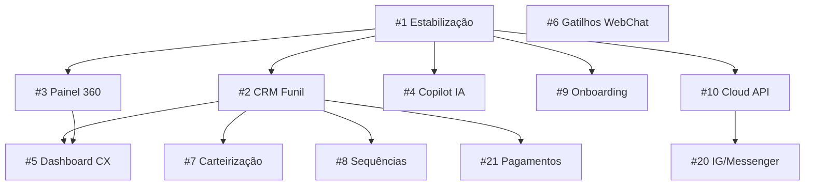

# Radar Chat — Plano de upgrades (21 épicos)

**Criado:** 2026-06-27  
**Versão ref produto:** `2.12.6`  
**Base de análise:** [`RADARCHAT-SISTEMA-COMPLETO.md`](./RADARCHAT-SISTEMA-COMPLETO.md), TOPs 01–21, [`RADARCHAT-VISAO-PRODUTO-DIFERENCIACAO.md`](./concluidos/RADARCHAT-VISAO-PRODUTO-DIFERENCIACAO.md), [`referencias/REFERENCIAS-MERCADO-UPGRADES.md`](./referencias/REFERENCIAS-MERCADO-UPGRADES.md)

> **Regra deste documento:** cada item lista **tudo** necessário para considerar o épico **completo** (não MVP parcial). Itens marcados como “já existe parcial” indicam o que falta fechar.

---

## Legenda de prioridade

| Faixa | Nível | Quando executar |
|-------|--------|-----------------|
| **1–5** | **Principal** | Maior impacto em conversão, estabilidade ou diferenciação — executar primeiro após gate mínimo |
| **6–10** | **Intermediária** | Fortalece produto e retenção; depende parcialmente dos principais |
| **11–15** | **Baixa** | Melhoria incremental ou nicho; após núcleo comercial estável |
| **16–21** | **Opcional** | Longo prazo, escopo ampliado ou mercado específico |

**Pré-requisito global:** não iniciar épicos 2–21 em produção real enquanto o **#1** não atingir critério de completo (ou exceção documentada por Benhur).

---

## Visão do sistema hoje (resumo da análise)

| Módulo | Status | Lacuna principal |
|--------|--------|------------------|
| Inbox WA + WebChat unificado | ✅ Implementado | QA manual real pendente |
| Ticket TK + token | ✅ Implementado | WebChat ↔ ticket sync parcial |
| Bridge WebChat↔WA | ✅ Código fechado | QA real + auto-assumir opcional |
| Modos atendimento (4) | ✅ Implementado | Orquestração “supervisor” ausente |
| IA Básica / Premium + créditos | ✅ Implementado | Copilot humano limitado |
| Leads + Kanban + dedupe | ✅ TOP 09 | Funil **não** unificado com Inbox/contato |
| Contato (`Destination`) | ✅ Rico (LGPD, tags) | `commercialStatus` sem UX funil completa |
| Relatórios Inbox | ✅ TMA, fila, CSAT 7d | Sem funil site→venda |
| WebChat widget | ✅ Amplo | Só gatilho 30s; resto backlog |
| Campanhas + fila humanizada | ✅ Implementado | Sequências/nurturing ausentes |
| Carteirização | 🟡 Partial (assign Inbox) | Owner persistente no contato |
| Cloud API Meta | 🔴 Stub 503 | Fase 2 |
| Onboarding wizard | 🔴 Inexistente | Só docs embed |
| Portal titular LGPD | 🔴 Pendente | Export CSV existe |
| Billing Stripe | 🟡 Test mode | Live + portal + trial runtime |

---

# PRINCIPAIS (1–5)

---

## 1. Estabilização atendimento + go-live controlado

**Objetivo:** Núcleo WA × Inbox × Ticket × CSAT × IA × Bridge **validado em ambiente real**, com gates humanos verdes — base para qualquer upgrade comercial.

**Gap hoje:** Gates automatizados verdes (772 testes); **QA manual A–J pendente**; VPS/SSL/deploy não executados ([`top/RADARCHAT-TOP-20`](./top/RADARCHAT-TOP-20-CONGELAMENTO-FINAL-GO-LIVE-CONTROLADO.md)).

### Entregáveis completos

#### QA manual (obrigatório)
- [ ] Executar blocos **A–J** com template [`QA-FASE1-RESULTADO-TEMPLATE.md`](./QA-FASE1-RESULTADO-TEMPLATE.md)
- [ ] Bloco **D** WhatsApp: QR, sessão, inbound/outbound, comandos `!ajuda`…`!encerrarchat`, rate limit real
- [ ] Bloco **E** Bridge: fallback → alerta WA → `!assumir` → resposta WebChat → encerramento **sem loop**
- [ ] Bloco **F** Tickets: TK+token, janela 12h, notas internas, consulta pública
- [ ] Bloco **G** Leads/formulários: embed, dedupe, Kanban, limite plano
- [ ] Bloco **H** IA: 4 modos, sem crédito, handoff, logs
- [ ] Bloco **I** Billing Stripe **test**: checkout, webhook, pacote IA, bloqueio limite
- [ ] Bloco **J** Segurança: cross-tenant, consentimento, export CSV, logs sem segredo
- [ ] Registrar evidências (prints, refs TK, timestamps) no template

#### Correções pós-QA
- [ ] Todo bug **crítico** encontrado corrigido + teste de regressão (unit ou integração)
- [ ] Re-run `npm test` + `npm run qa:atendimento:gate` + `npm run qa:fase1:e2e` verdes após fixes

#### Infra mínima staging (Fase 3 — referência [`PREPARACAO-PRODUCAO.md`](./PREPARACAO-PRODUCAO.md))
- [ ] VPS + Docker + Mongo + Redis + env produção (sem commit secrets)
- [ ] Domínio + SSL (Caddy/Let's Encrypt)
- [ ] `SESSION_ENCRYPTION_KEY`, `STRIPE_*` test, webhooks URL pública
- [ ] Backup Mongo agendado + política retenção documentada
- [ ] Smoke pós-deploy: login painel, QR WA, widget embed, envio teste

#### Documentação e governança
- [ ] Atualizar [`ROADMAP-COMPLETUDE.md`](./ROADMAP-COMPLETUDE.md) — gate § Estabilização marcado
- [ ] [`CHANGELOG.md`](./CHANGELOG.md) + versão patch se fixes
- [ ] Status em [`RADARCHAT-SISTEMA-COMPLETO.md`](./RADARCHAT-SISTEMA-COMPLETO.md): `PRONTO PARA GO-LIVE CONTROLADO` ou lista de bloqueios

#### Critério de completo
Todos os blocos A–J **pass** em staging ou produção piloto; zero bug crítico aberto em atendimento; deploy repetível documentado.

**Dependências:** nenhuma (é a base).  
**Código ref:** `InboxService`, `WhatsAppService`, `webchat-*`, `csat.util`, `ticket-reply-window.util`.

---

## 2. CRM conversacional unificado (funil completo)

**Objetivo:** Um **único funil comercial** visível e editável a partir de contato, lead, conversa Inbox e ticket — alinhado à visão “central de vendas”.

**Gap hoje:** `lead-stage.util.ts` + Kanban leads existem; `Destination.commercialStatus` existe no modelo; **não há** funil unificado na UI Inbox, nem sync automático conversa→estágio, nem valor estimado/motivo perda padronizado ([`RADARCHAT-VISAO-PRODUTO` §3.7](./concluidos/RADARCHAT-VISAO-PRODUTO-DIFERENCIACAO.md)).

### Entregáveis completos

#### Modelo e tipos
- [ ] Enum oficial de estágios produto (usar/estender `ProductLeadStage`): `new` → `contact_attempt` → `in_service` → `qualified` → `proposal_sent` → `won` | `lost` | `no_response`
- [ ] Campos em `Destination`: `commercialStatus`, `dealValueEstimated`, `dealCurrency` (BRL default), `lossReason`, `assignedOwnerUserId`, `nextFollowUpAt`, `lastStageChangedAt`, `stageChangedByUserId`
- [ ] Campos em `LeadCapture`: sync bidirecional com contato quando `destinationId` vinculado
- [ ] Campos em `InboxConversation`: `commercialStageSnapshot` (opcional cache) + `dealValueEstimated` override por conversa
- [ ] Migração/backfill lazy: contatos existentes → `new` ou inferir de lead aberto

#### Backend / serviços
- [ ] `CommercialPipelineService` (novo): `changeStage`, `getPipelineSummary`, regras transição (ex.: `won` exige valor ou nota)
- [ ] Hooks em `InboxService`: ao **Assumir** → `in_service`; ao **Finalizar** com CSAT positivo → sugerir `qualified`; webhook interno `commercial.stage_changed`
- [ ] Hooks em formulário/WebChat pré-chat: lead criado → contato `new` + lead `new`
- [ ] API REST:
  - `GET /api/contacts/:id/pipeline` — histórico estágios + conversas/tickets ligados
  - `PATCH /api/contacts/:id/pipeline` — mudança manual estágio + campos deal
  - `GET /api/pipeline/board` — colunas Kanban agregadas (contatos + leads)
  - `PATCH /api/leads/:id/stage` — alinhado ao mesmo enum (deprecar status legado na UI)
- [ ] Webhooks outbound: evento `contact.stage_changed` (payload: old/new, owner, valor)
- [ ] RBAC: `contacts:manage` ou nova cap `pipeline:manage`; atendente pode mover só próprios se política org

#### Frontend
- [ ] **Kanban unificado** `/platform/pipeline` (ou evoluir Leads Kanban): colunas = estágios; cards = contato + último canal + owner + valor
- [ ] **Inbox painel lateral:** seletor estágio + valor + motivo perda + lembrete follow-up
- [ ] **Contatos** (`/contact`): mesmos campos; badge estágio na lista
- [ ] Filtros lista Inbox: por estágio comercial
- [ ] Ações rápidas: “Marcar proposta enviada”, “Ganho”, “Perdido” com modal motivo

#### Regras de negócio
- [ ] Lead `converted` ↔ contato `won` sincronizados
- [ ] `lost` / `no_response` não bloqueia novo atendimento Inbox
- [ ] Limites plano: contatos/leads existentes (`config/plans.json`) — enforcement já parcial TOP 03/17

#### Testes
- [ ] Unit: transições válidas/inválidas, mapeamento `lead-stage.util`
- [ ] Integração: inbound WA comercial → contato stage; PATCH pipeline; webhook emitido
- [ ] E2E: mover card Kanban + refletir no Inbox

#### Documentação
- [ ] Atualizar [`LEADS-FORMULARIO.md`](./LEADS-FORMULARIO.md), [`INBOX-ATENDIMENTO.md`](./INBOX-ATENDIMENTO.md), [`MENU-PAGES-REGISTRY.md`](./MENU-PAGES-REGISTRY.md)
- [ ] OpenAPI em `openapi-dashboard.ts`

#### Critério de completo
Atendente altera estágio no Inbox **e** no Kanban **e** na ficha contato com **mesmo dado**; histórico auditável; webhooks documentados; testes no gate.

**Dependências:** #1 recomendado.  
**Inspiração interna:** VoxCRM funil conversacional, visão produto §3.7.

---

## 3. Painel contextual 360° do cliente (Inbox)

**Objetivo:** Atendente vê **tudo** sobre o cliente em um painel lateral sem trocar de tela: origem, jornada, tickets, CSAT, bridge, IA, consentimento.

**Gap hoje:** Inbox 3 colunas com perfil editável parcial; falta timeline unificada WA+WebChat+TK, origem UTM/página, métricas CSAT histórico, indicadores comerciais (#2).

### Entregáveis completos

#### Backend
- [ ] `GET /api/inbox/conversations/:id/context` — payload agregado:
  - Contato (`Destination`) completo + consentimento LGPD
  - Lead(s) abertos/fechados vinculados
  - Tickets `TK-*` do contato (lista + status SLA)
  - Sessões WebChat: `pageUrl`, `referrer`, UTM, tempo no site, pré-chat fields
  - Bridge: `whatsappBridgeActive`, histórico eventos bridge
  - CSAT: últimas notas + média
  - Campanhas: último envio / origem campanha se houver
  - Estágio comercial (#2)
  - Tags, grupos, notas internas
- [ ] Cache TTL curto (30s) ou invalidação WS em nova mensagem
- [ ] RBAC: respeitar `inbox:view`; dados sensíveis consentimento conforme cap

#### Frontend (`Inbox.tsx` painel direito)
- [ ] Abas ou seções colapsáveis: **Resumo** | **Jornada** | **Comercial** | **Chamados** | **LGPD**
- [ ] Timeline unificada cronológica (WA + WebChat + eventos sistema + TK)
- [ ] Badge canal origem (Site / WhatsApp / Formulário / Campanha)
- [ ] Link deep: abrir ticket, abrir contato, abrir lead Kanban
- [ ] WebChat: exibir URL página atual + UTM chips
- [ ] Empty states claros quando dado ausente

#### Integrações
- [ ] Widget: garantir UTM/referrer em `WebChatPublicConfig` session persistida (`getPublicConfig` espelho)
- [ ] Formulário embed: origem `contactOrigin: form`

#### Testes
- [ ] Unit: montagem payload context (mocks)
- [ ] Integração: conversa `wc:` com bridge + ticket retorna blocos corretos
- [ ] E2E Inbox: painel carrega sem N+1 (performance aceitável < 500ms p95 dev)

#### Documentação
- [ ] [`INBOX-ATENDIMENTO.md`](./INBOX-ATENDIMENTO.md) § Painel 360
- [ ] Contrato API OpenAPI

#### Critério de completo
Uma conversa WebChat com bridge ativa + ticket aberto mostra **todos** os blocos corretos; atendente não precisa abrir 3 menus diferentes.

**Dependências:** #2 recomendado (bloco Comercial). Parcialmente independente.  
**Inspiração:** Nextiva unified profile.

---

## 4. Copilot IA + resumo automático pós-atendimento

**Objetivo:** IA **assiste** o humano (sugestões, intenção, próximo passo) e **resume** conversas/tickets ao encerrar — reduzindo tempo e melhorando handoff.

**Gap hoje:** Quick replies, `AiTicketAssistService`, IA Premium no bot; **sem** sugestão contextual no composer Inbox; **sem** resumo automático persistido.

### Entregáveis completos

#### Backend — Copilot (tempo real)
- [ ] `InboxCopilotService`: `suggestReply(clientId, conversationId, opts)` — usa últimas N mensagens + KB + estágio comercial
- [ ] Gate: `inbox:ai:manage` ou `inbox:view`; consome créditos IA se LLM Radar Chat (mesmo meter TOP 16)
- [ ] Rate limit por conversa (ex.: 1 sugestão / 15s)
- [ ] Modo **local-first** opcional: só intenção/heurística sem LLM (`basic-triage-classifier` extendido)
- [ ] API: `POST /api/inbox/conversations/:id/copilot/suggest`
- [ ] Resposta: `{ suggestion, intent, confidence, sources[] }` — **nunca** enviar auto sem clique humano
- [ ] Audit: `AttendanceEvent` `copilot.suggested` (sem prompt completo em log)

#### Backend — Resumo pós-encerramento
- [ ] `ConversationSummaryService`: trigger em `InboxService.finalizeConversation` e `closeTicket`
- [ ] Persistir em `InboxConversation.summary` + `InboxTicket.internalSummary` (texto + bullet next steps)
- [ ] Fallback se sem crédito: resumo heurístico local (últimas msgs + estágio)
- [ ] API: `GET /api/inbox/conversations/:id/summary`; regenerar manual `POST .../summary/regenerate`

#### Frontend
- [ ] Botão **Sugerir resposta** no composer (Inbox WA + WebChat)
- [ ] Chip intenção detectada (vendas, suporte, reclamação…)
- [ ] Ao finalizar: modal/card **Resumo da conversa** editável antes de fechar
- [ ] Ticket detalhe: bloco resumo IA + notas internas separadas
- [ ] Toggle org: desligar copilot/resumo (`AiSettings`)

#### Configuração
- [ ] `AiSettings`: `copilotEnabled`, `autoSummaryOnClose`, `copilotUseLlm`
- [ ] Limites plano: copilot só Pro+ ou consome créditos

#### Testes
- [ ] Unit: gate crédito, sanitize resposta, fallback local
- [ ] Integração: finalize → summary persistido
- [ ] Mock LLM nos testes

#### Documentação
- [ ] [`IA-CREDITOS-E-CARTEIRA.md`](./IA-CREDITOS-E-CARTEIRA.md) — consumo copilot/resumo
- [ ] [`INBOX-ATENDIMENTO.md`](./INBOX-ATENDIMENTO.md)

#### Critério de completo
Atendente clica sugerir → insere texto; ao finalizar → resumo salvo visível na reabertura do contato/ticket; créditos debitados corretamente; opt-out org funciona.

**Dependências:** #1; #16 créditos IA já existe.  
**Inspiração:** Nextiva Agent Assist + XBert summaries.

---

## 5. Dashboard CX e relatórios de conversão

**Objetivo:** Dono/gestor vê **valor do produto**: funil site→lead→venda, IA vs humano, CSAT, conversão por página/atendente.

**Gap hoje:** `InboxReportsService` (TMA, fila, setor); supervisor 7d; **sem** funil comercial agregado nem origem WebChat/UTM.

### Entregáveis completos

#### Backend
- [ ] `ConversionReportsService` + `GET /api/reports/conversion?from&to`
- [ ] Métricas:
  - Visitantes WebChat únicos / conversas iniciadas / leads capturados / assumidas humano / `won`
  - Taxa por etapa funil (#2)
  - % resolvido só IA (robotic/basic/premium sem assign humano)
  - CSAT médio + distribuição 1–5
  - Tempo médio até primeira resposta humana
  - Top páginas origem (UTM/path)
  - Campanhas → respostas → conversões
  - Tickets abertos/fechados / SLA breach count
- [ ] `GET /api/reports/cx-dashboard` — payload único para home gestor
- [ ] Export CSV/PDF opcional (CSV mínimo obrigatório)
- [ ] RBAC: `inbox:reports:view` + nova `reports:conversion:view` se necessário

#### Frontend
- [ ] Página `/platform/reports/conversao` (ou expandir `InboxReports.tsx`)
- [ ] Cards KPI + gráficos (recharts — já no projeto)
- [ ] Filtros: período, canal, setor, atendente, origem UTM
- [ ] Link drill-down → lista contatos/conversas filtrada
- [ ] Widget resumo na home tenant (opcional neste épico: card compacto)

#### Dados
- [ ] Agregação Mongo (pipeline) performática; índices em `createdAt`, `commercialStatus`, `channel`
- [ ] Job noturno opcional `ReportSnapshot` para períodos longos (90d+) — se query lenta

#### Testes
- [ ] Unit: cálculos taxa conversão, divisão por zero
- [ ] Integração: seed fixtures → report JSON esperado

#### Documentação
- [ ] [`INBOX-ATENDIMENTO.md`](./INBOX-ATENDIMENTO.md) § Relatórios
- [ ] [`MENU-PAGES-REGISTRY.md`](./MENU-PAGES-REGISTRY.md)

#### Critério de completo
Gestor filtra 30 dias e vê funil completo com números coerentes com Kanban (#2); export CSV funciona; caps respeitadas.

**Dependências:** #2 fortemente recomendado; #3 para métricas origem/UTM.  
**Inspiração:** Nextiva CX dashboard; visão produto §3.9.

---

# INTERMEDIÁRIAS (6–10)

---

## 6. Gatilhos WebChat inteligentes (além de 30s)

**Objetivo:** Widget reage a **comportamento** do visitante para aumentar conversão — sem spam.

**Gap hoje:** Saudação proativa 30s ([`WEBCHAT.md`](./WEBCHAT.md) 2.10.25); demais gatilhos ausentes.

### Entregáveis completos

#### Configuração (`WebChatWidget.appearance` + settings)
- [ ] `proactiveTriggers[]`: `{ id, type, enabled, config }`
- [ ] Tipos: `time_on_page`, `scroll_depth`, `page_url_match`, `exit_intent`, `return_visit`, `utm_campaign`, `outside_business_hours`, `idle_on_page`
- [ ] Por gatilho: delay, mensagem, abrir chat/minimizado, respeitar `once_per_session` / cooldown
- [ ] Prioridade entre gatilhos (first match wins)
- [ ] **Espelho obrigatório** em `getPublicConfig()` + `widget.js`

#### Widget (`widget.js`)
- [ ] Listeners: scroll, mouseleave (exit), visibility, history (return visit)
- [ ] Match URL/UTM regex configurável
- [ ] Horário comercial já existente — integrar gatilho offline
- [ ] Não disparar se conversa já aberta ou pós-encerramento sessão
- [ ] Telemetria anonimizada: `webchat.trigger.fired` → webhook opcional

#### Backend
- [ ] PATCH widget validação schema (zod)
- [ ] Preview no painel: simular gatilho

#### Frontend painel
- [ ] UI `/platform/webchat` — editor gatilhos com toggles + preview
- [ ] Templates prontos: “página de preço”, “checkout”, “segunda visita”

#### Testes
- [ ] Unit: eval trigger rules
- [ ] E2E widget: mock page events ([`QA-WEBCHAT-CHATBOX-MODELS.md`](./QA-WEBCHAT-CHATBOX-MODELS.md) pattern)

#### Documentação
- [ ] [`WEBCHAT.md`](./WEBCHAT.md) § Gatilhos
- [ ] Regra agente `webchat-widget-config-sync.mdc`

#### Critério de completo
Mínimo **4 tipos** de gatilho funcionando em site real; painel salva e widget recebe; cooldown respeitado.

**Dependências:** #1 para QA WebChat.  
**Inspiração:** visão produto §3.5.

---

## 7. Carteirização e owner persistente do contato

**Objetivo:** Cada contato tem **dono comercial**; fila respeita carteira; transferência com política clara.

**Gap hoje:** Assign na conversa Inbox; sem owner em `Destination.assignedOwnerUserId` operacional.

### Entregáveis completos

#### Modelo
- [ ] `Destination.assignedOwnerUserId` (index)
- [ ] `Organization.teamSettings.portfolioMode`: `off` | `soft` | `strict`
- [ ] `portfolioMaxContactsPerUser` por plano

#### Backend
- [ ] `PortfolioService`: assign, transfer, bulk assign, auto-assign inbound comercial
- [ ] Fila: em `soft`, preferir owner online; em `strict`, só owner ou supervisor redistribui
- [ ] Round-robin ignora contatos com owner em strict
- [ ] API: `PATCH /contacts/:id/owner`, `POST /portfolio/transfer`, `GET /portfolio/my`
- [ ] Webhook `contact.owner_changed`
- [ ] RBAC: `contacts:manage` / supervisor override

#### Frontend
- [ ] Ficha contato + Inbox 360: avatar owner + trocar
- [ ] Filtro “Minha carteira” na lista contatos e Inbox
- [ ] Supervisor: redistribuir carteira em lote

#### Testes
- [ ] Unit: strict vs soft routing
- [ ] Integração: inbound → owner existente → assign direto

#### Documentação
- [ ] [`EQUIPE-RBAC.md`](./EQUIPE-RBAC.md), [`INBOX-ATENDIMENTO.md`](./INBOX-ATENDIMENTO.md)

#### Critério de completo
Modo strict impede outro atendente assumir sem transferência; relatório “contatos por owner” disponível.

**Dependências:** #2 recomendado.  
**Inspiração:** VoxCRM carteirização.

---

## 8. Sequências e automações pós-consentimento

**Objetivo:** Follow-up automático **LGPD-safe** após captura, fechamento ou estágio funil — nurturing sem campanha manual repetida.

**Gap hoje:** Campanhas one-shot; fila humanizada; **sem** sequência multi-step temporal.

### Entregáveis completos

#### Modelo
- [ ] `AutomationSequence`: `{ name, trigger, steps[], status, clientId }`
- [ ] `SequenceEnrollment`: contato + sequência + step atual + nextRunAt
- [ ] Triggers: `lead_created`, `stage_changed`, `conversation_closed`, `csat_received`, `form_submitted`, `tag_added`
- [ ] Steps: `wait`, `send_whatsapp` (template/campanha), `send_webhook`, `change_stage`, `assign_owner`, `create_ticket`
- [ ] BullMQ worker `sequence-runner`

#### Backend
- [ ] Enforcement consentimento: **não** enviar WA se `consentStatus` não permitir
- [ ] Cancel enrollment se opt-out / resposta inbound / humano assume
- [ ] API CRUD `/api/automations/sequences` + `POST .../enroll` manual
- [ ] Limites plano: max sequências ativas, max enrollments/mês
- [ ] RBAC: `campaigns:manage` ou nova `automations:manage`

#### Frontend
- [ ] Builder **linear** (lista steps — não precisa canvas drag-drop neste épico)
- [ ] Log execução por contato
- [ ] Toggle pausar sequência

#### Testes
- [ ] Unit: schedule next step, cancel on reply
- [ ] Integração: trigger lead_created → 2 steps → mensagem na fila WA

#### Documentação
- [ ] Novo `AUTOMACOES-SEQUENCIAS.md` + webhook events
- [ ] [`WEBHOOKS.md`](./WEBHOOKS.md)

#### Critério de completo
Sequência 3 passos (wait + WA + change stage) executa end-to-end em dev; opt-out cancela; audit log completo.

**Dependências:** #1, #2, consentimento LGPD.  
**Inspiração:** VoxCRM sequências.

---

## 9. Onboarding wizard (primeira configuração)

**Objetivo:** Nova org configura Radar Chat em **< 15 min** sem suporte: widget, WA, equipe, modo atendimento, teste.

**Gap hoje:** Embed manual + docs; sem fluxo guiado.

### Entregáveis completos

#### Backend
- [ ] `Organization.onboarding`: `{ completedSteps[], dismissedAt?, version }`
- [ ] `GET /api/onboarding/status` + `PATCH /api/onboarding/step`
- [ ] Seed automático: setor default, quick reply exemplo, FAQ exemplo (opcional toggle)

#### Frontend
- [ ] Rota `/platform/onboarding` + banner persist até completo
- [ ] Passos: (1) Perfil empresa (2) Conectar WA QR (3) Convidar 1 membro (4) Customizar widget (5) Colar script (6) Modo atendimento (7) Enviar msg teste (8) Concluir
- [ ] Checklist com ✅; links deep para cada tela
- [ ] Modo “pular” com confirmação — marca dismissed
- [ ] Snippet copy script + verificador “widget detectado” (ping público opcional)

#### Integrações doc
- [ ] Guias inline WordPress, HTML, React, Nuvemshop (links docs)

#### Testes
- [ ] E2E: completar wizard mock WA
- [ ] Unit: progress calculation

#### Documentação
- [ ] [`RADARCHAT-VISAO-PRODUTO` §3.10](./concluidos/RADARCHAT-VISAO-PRODUTO-DIFERENCIACAO.md)
- [ ] [`MENU-PAGES-REGISTRY.md`](./MENU-PAGES-REGISTRY.md)

#### Critério de completo
Org nova vê wizard; completar 8 passos esconde banner; status persistido; OWNER pode reabrir em Configurações.

**Dependências:** #1 (WA real no passo 2).  
**Inspiração:** Nextiva demo center; visão produto §3.10.

---

## 10. Camada WhatsApp Cloud API (Meta) — produção

**Objetivo:** Abstração canal WA: Baileys **ou** Cloud API por org — preparando compliance e multicanal Meta.

**Gap hoje:** Stub 503 em `DashboardService`; Baileys único canal real.

### Entregáveis completos

#### Arquitetura
- [ ] Interface `IWhatsAppChannelProvider`: connect, send, disconnect, status, webhook ingest
- [ ] `BaileysWhatsAppProvider` (refator existente)
- [ ] `CloudApiWhatsAppProvider` (Meta Graph API v18+)
- [ ] Factory por org: `Organization.whatsappChannel: 'baileys' | 'cloud_api'`

#### Cloud API
- [ ] Credenciais: `phoneNumberId`, `wabaId`, `accessToken` (encrypted), webhook verify token
- [ ] OAuth/callback ou manual paste token (documentar BSP path)
- [ ] Webhook `POST /api/webhooks/meta/whatsapp`: messages, statuses, template events
- [ ] Templates HSM: listar, enviar campanha cloud-only
- [ ] Rate limits Meta respeitados; fila outbound unificada

#### Painel
- [ ] Settings: escolher canal; form credenciais Cloud; test connection
- [ ] Status diferenciado Baileys (QR) vs Cloud (connected sem QR)
- [ ] Migração assistida doc (número Baileys → Cloud — processo manual Meta)

#### Inbox / campanhas
- [ ] `InboxConversation.channelProvider` metadata
- [ ] Campanhas: bloquear HSM se só Baileys; UI aviso

#### Testes
- [ ] Unit: provider factory, webhook signature
- [ ] Integração mock Meta payloads
- [ ] Não quebrar Baileys existente (regressão gate)

#### Documentação
- [ ] `WHATSAPP-CLOUD-API.md` (novo)
- [ ] [`ROADMAP-COMPLETUDE.md`](./ROADMAP-COMPLETUDE.md) Fase 2
- [ ] OpenAPI webhook Meta

#### Critério de completo
Org teste envia/recebe via Cloud API em staging Meta; Baileys continua default; toggle por org funciona; webhooks verificados.

**Dependências:** #1; decisão credenciais Meta/BSP.  
**Inspiração:** VoxCRM API oficial; roadmap Fase 2.

---

# BAIXA PRIORIDADE (11–15)

---

## 11. Templates por segmento / vertical

**Objetivo:** Org escolhe “clínica”, “loja”, etc. e recebe **pacote completo** pré-configurado.

**Gap hoje:** `seed-platform-templates` parcial; sem picker vertical na UI.

### Entregáveis completos
- [ ] Catálogo `config/vertical-templates/*.json`: setores, FAQ seed, quick replies, pré-chat, horário, `attendanceMode`, mensagens campanha exemplo
- [ ] `POST /api/onboarding/apply-template/:verticalId` — idempotente, merge seguro
- [ ] UI: galeria vertical na criação org + Configurações → “Aplicar template”
- [ ] Preview diff antes aplicar (o que será sobrescrito)
- [ ] mínimo **8 verticais** (clínica, loja, oficina, imobiliária, advocacia, restaurante, solar, suporte TI)
- [ ] Testes: apply não duplica setores; RBAC owner only
- [ ] Doc [`RADARCHAT-VISAO-PRODUTO` §3.8](./concluidos/RADARCHAT-VISAO-PRODUTO-DIFERENCIACAO.md)

**Critério de completo:** Aplicar “clínica” cria setores+FAQ+pré-chat utilizáveis no widget sem edição manual.

**Dependências:** #9 recomendado.

---

## 12. Supervisor IA (roteamento por intenção)

**Objetivo:** Camada acima da triagem que **escolhe** fluxo/setor/agente IA conforme intenção — “supervisor” interno, não marca terceira.

**Gap hoje:** `basic_triage` + escalação; sem multi-agente orquestrado.

### Entregáveis completos
- [ ] `AiRoutingPolicy` por org: regras `{ intent, minConfidence, targetDepartmentId, aiMode, fallback }`
- [ ] Serviço `AiSupervisorService` pós-classificação (#14 local ou LLM leve)
- [ ] Intents extendidos: `sales`, `support`, `billing`, `scheduling`, `complaint`, …
- [ ] Transferência entre “perfis” IA (vendas vs suporte) com audit
- [ ] UI `/platform/ai/routing` — tabela regras (não canvas)
- [ ] WebChat + WA usam mesma policy
- [ ] Testes: intent sales → setor comercial; low confidence → fila
- [ ] Doc modos atendimento consolidado

**Critério de completo:** 5 intents configuráveis roteiam corretamente em WA e WebChat; handoff humano preservado.

**Dependências:** #4, modos atendimento estáveis.

---

## 13. Catálogo de integrações + conectores webhook

**Objetivo:** Painel lista integrações (ERP, CRM, n8n, Zapier-like) com **templates** de webhook e payloads — além da API genérica.

**Gap hoje:** Webhooks + OpenAPI; UI técnica em Settings.

### Entregáveis completos
- [ ] Registry `config/integrations/*.json`: `{ id, name, events[], payloadTemplate, docsUrl }`
- [ ] UI `/settings#integrations-catalog`: cards + “Ativar” cria `WebhookEndpoint` pré-configurado
- [ ] mínimo **6 conectores** documentados: genérico, n8n, Make, HubSpot (payload example), Google Sheets (via webhook), ERP genérico
- [ ] Assistente teste: enviar evento sample + ver resposta
- [ ] HMAC doc + retry policy visível
- [ ] OpenAPI tags alinhadas
- [ ] Doc [`WEBHOOKS.md`](./WEBHOOKS.md) expandido

**Critério de completo:** Usuário ativa template n8n e recebe evento `conversation.closed` formatado sem editar JSON do zero.

**Dependências:** webhooks estáveis (#1).

---

## 14. Enriquecimento B2B (CNPJ) no contato

**Objetivo:** Consulta Receita Federal enriquece contato/lead B2B antes abordagem.

**Gap hoje:** Campos `organization` manual; sem API CNPJ.

### Entregáveis completos
- [ ] Provider plugável `CnpjLookupProvider` (Brasil API / ReceitaWS / pago)
- [ ] Campos `Destination`: `cnpj`, `legalName`, `tradeName`, `companySize`, `registrationStatus`, `partners[]`, `cnpjFetchedAt`
- [ ] API `POST /contacts/:id/enrich-cnpj` + bulk `POST /contacts/enrich-cnpj`
- [ ] UI: botão consultar + exibir dados; import CSV coluna CNPJ
- [ ] Rate limit + cache 24h; custo/crédito opcional por plano
- [ ] LGPD: uso declarado na política; só B2B
- [ ] Testes mock provider

**Critério de completo:** CNPJ válido preenche razão social e situação; bulk 100 contatos com progresso.

**Dependências:** módulo contatos.  
**Inspiração:** RadarLeads.

---

## 15. Portal titular LGPD + NPS pós-atendimento

**Objetivo:** Compliance completo titular de dados + métrica NPS além do CSAT 1–5.

**Gap hoje:** Consentimento + export CSV; CSAT Inbox; portal titular pendente ([`CONSENTIMENTO-LGPD.md`](./CONSENTIMENTO-LGPD.md)).

### Entregáveis completos

#### Portal titular
- [ ] Rotas públicas `/lgpd/:token` — solicitar export, retificação, exclusão, revogar consentimento
- [ ] Token OTP e-mail ou SMS WA; expiração 15 min
- [ ] Workflow admin: fila pedidos DSR em `/platform/lgpd/requests`
- [ ] Prazo SLA 15 dias — alertas
- [ ] Audit `AuditLog` imutável

#### NPS
- [ ] `InboxSettings.npsEnabled` + pergunta configurável
- [ ] Disparo pós-encerramento (alternativa ou pós CSAT)
- [ ] Escala 0–10 + comentário opcional
- [ ] Agregação em #5 dashboard CX
- [ ] Testes CSAT+NPS não conflitam

**Critério de completo:** Titular acessa link, exporta dados; NPS aparece no dashboard; DSR auditável.

**Dependências:** #1, #5 recomendado.

---

# OPCIONAIS (16–21)

---

## 16. App mobile / PWA atendente completo

**Objetivo:** Atendente responde pelo celular com paridade **core** do Inbox web.

**Gap hoje:** PWA manifest 2.5.1; sem app nativo; Inbox desktop-first.

### Entregáveis completos
- [ ] PWA: service worker cache shell; push notifications (web push VAPID or FCM wrapper)
- [ ] Layout mobile Inbox: lista + chat + assumir + anexos imagem
- [ ] Presença heartbeat mobile
- [ ] Opcional React Native / Capacitor shell — **só se PWA insuficiente**
- [ ] Testes device matrix iOS/Android browser
- [ ] Doc instalação “Adicionar à tela inicial”

**Critério de completo:** Assumir conversa WA, responder texto, receber WS/push em Android Chrome e iOS Safari.

**Dependências:** #1, Inbox estável.

---

## 17. Mapa geográfico de contatos e campanhas

**Objetivo:** Visualizar leads/contatos no mapa para rotas comerciais.

### Entregáveis completos
- [ ] Geocoding address → lat/lng (batch; provider configurável)
- [ ] Campos endereço estruturado em contato (rua, cidade, UF, CEP)
- [ ] UI `/platform/contacts/map` — cluster, filtros segmento/carteira
- [ ] Export “rota do dia” CSV ordem sugerida (simples nearest-neighbor)
- [ ] Privacidade: cap `contacts:view`; não expor mapa público

**Critério de completo:** 500 contatos com CEP plotados; filtros funcionam.

**Inspiração:** RadarLeads.

---

## 18. Agendamento via IA + calendário externo

**Objetivo:** Cliente agenda horário no chat; IA verifica disponibilidade.

### Entregáveis completos
- [ ] `SchedulingSettings`: business hours, slot duration, buffer
- [ ] Integração Google Calendar / Cal.com / webhook genérico (OAuth)
- [ ] Tool IA Premium `book_appointment` + confirmação WA/WebChat
- [ ] Lembrete automático (sequência #8) 24h antes
- [ ] UI gestão slots bloqueados
- [ ] Testes conflito de horário

**Critério de completo:** Cliente agenda via WebChat; evento no Google Calendar; lembrete enviado.

**Dependências:** #4, #8, #10 opcional Cloud templates.

---

## 19. Status page pública + SLO operacional

**Objetivo:** Transparência uptime para clientes (modelo VoxCRM “23 min downtime”).

### Entregáveis completos
- [ ] Página pública `status.radarchat.com.br` (ou `/status`)
- [ ] Componentes: API, WA gateway, WebChat, filas, Mongo, Redis.md
- [ ] Healthchecks automáticos + histórico 90d
- [ ] Incidentes manuais admin post
- [ ] Subscriber e-mail alerta (opcional)

**Critério de completo:** Status reflete health real; incidente manual aparece timeline.

**Dependências:** #1 deploy.

---

## 20. Multicanal Meta (Instagram Direct + Messenger)

**Objetivo:** Inbox recebe IG/Messenger via Cloud API — mesma fila.

### Entregáveis completos
- [ ] Estender `IWhatsAppChannelProvider` → `IMetaMessagingProvider`
- [ ] Webhook unificado Meta
- [ ] `InboxConversation.channel`: `instagram` | `messenger`
- [ ] UI ícones canal; filtros lista
- [ ] Limitações documentadas (janela 24h, templates)
- [ ] Testes mock Meta IG payload

**Critério de completo:** Mensagem IG teste aparece no Inbox unificado; resposta outbound funciona.

**Dependências:** #10 Cloud API.

---

## 21. Cobrança / Pix no fluxo comercial (opcional)

**Objetivo:** Enviar link pagamento no chat; marcar deal `won` com pagamento confirmado.

### Entregáveis completos
- [ ] Integração gateway BR (Stripe Pix / Mercado Pago / Asaas) — **um** provider
- [ ] `PaymentLink` model + webhook pagamento
- [ ] Mensagem WA/WebChat com link + status pending/paid
- [ ] Sync estágio funil #2 → `won` on paid
- [ ] RBAC financeiro; não armazenar PAN
- [ ] Doc compliance PCI

**Critério de completo:** Link Pix enviado no Inbox; webhook confirma; deal marcado ganho.

**Dependências:** #2, #10 recomendado; decisão gateway.

---

## Matriz de dependências (resumo)

---

## Ordem sugerida de execução (sprints)

| Sprint | Itens | Objetivo |
|--------|-------|----------|
| S0 | **#1** | Go-live confiável |
| S1 | **#2, #3** | CRM + contexto Inbox |
| S2 | **#4, #5** | IA assist + métricas valor |
| S3 | **#6, #7, #9** | Conversão site + carteira + onboarding |
| S4 | **#8, #10** | Automação + Cloud API |
| S5+ | **#11–#21** | Conforme demanda comercial |

---

## Protocolo ao implementar qualquer item

1. Ler checklist do item — **não fechar** épico com entregáveis faltando.
2. Incrementar `package.json` + [`CHANGELOG.md`](./CHANGELOG.md).
3. Atualizar doc módulo + [`MENU-PAGES-REGISTRY.md`](./MENU-PAGES-REGISTRY.md) se rotas/API.
4. Testes no `qa:atendimento:gate` quando tocar atendimento.
5. Marcar item como ✅ neste doc (data + versão) ao concluir.

---

## Histórico

| Data | Ação |
|------|------|
| 2026-06-27 | Plano 21 upgrades criado após análise sistema completo + refs mercado |

---

*Documento vivo — revisar após gate #1 ou mudança de prioridade comercial.*
