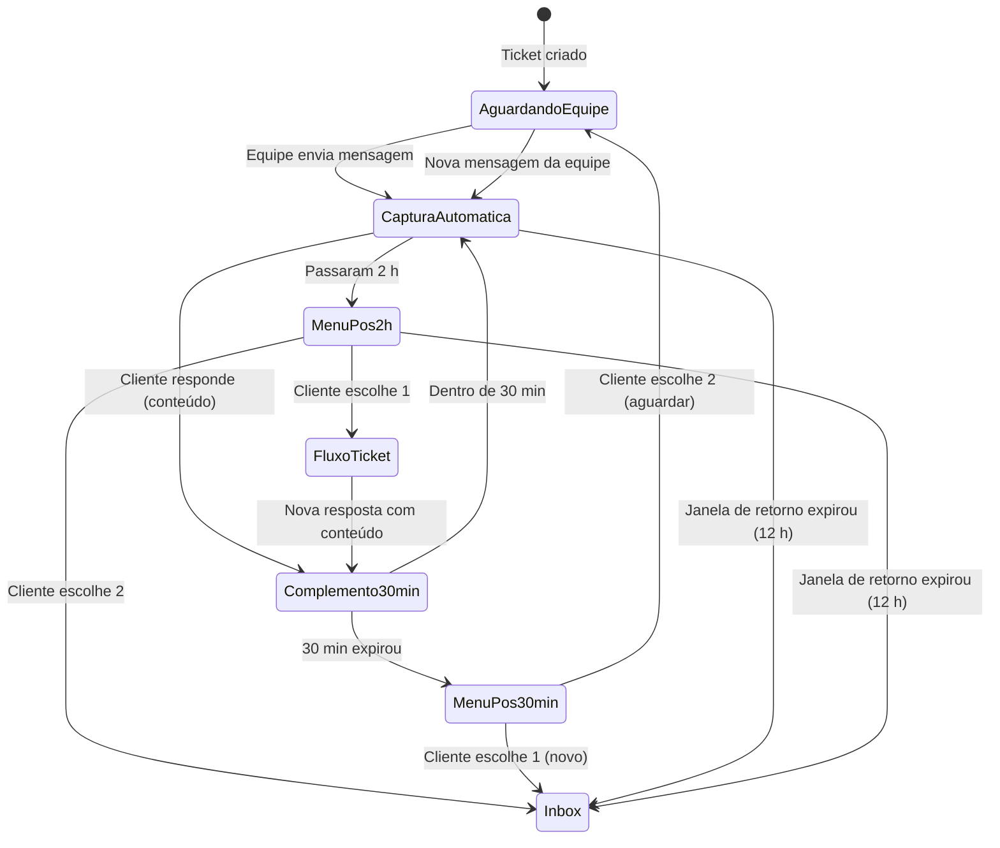

# Ticket — chamado assíncrono (RadarZap)

Documento de referência do produto: o que é um Ticket, como difere do Inbox, quem cria, janelas de tempo e regras de roteamento no WhatsApp.

**Última revisão:** 2026-06-10 (nomenclatura janelas, status × roteamento, prioridade WhatsApp, roadmap)  
**Implementação:** `src/services/inbox/InboxService.ts`, `src/types/inbox-ticket.ts`, `src/models/InboxTicket.ts`, `src/services/inbox/inbound-routing.ts`  
**Relacionado:** [INBOX-ATENDIMENTO.md](./INBOX-ATENDIMENTO.md) (atendimento ao vivo)

---

## Conceito

O **Ticket** no RadarZap é um **chamado separado** do atendimento ao vivo.

Use-o para problemas que **não** se resolvem na hora:

- processos demorados;
- análise interna;
- suporte técnico, financeiro, orçamento, manutenção, documentos;
- qualquer situação que dependa de **retorno posterior** da equipe.

| | **Inbox** | **Ticket** |
|---|-----------|------------|
| Papel | Atendimento **principal** — ao vivo | Acompanhamento **assíncrono** |
| Quando | Triagem, fila, setor, humano em tempo real | Problema demorado, pendente de análise |
| Referência | Conversa no painel Inbox | `TK-XXXXXX` |
| Trava o cliente? | **Não** deve travar | **Não** deve travar |

**Regra de ouro:** o Ticket **não substitui** o Inbox. O Ticket **não pode sequestrar** atendimento novo.

---

## Nomenclatura das janelas (aliases)

No produto e na documentação, use estes nomes — alinhados às constantes em `src/types/inbox-ticket.ts`:

| Alias (produto) | Duração | Constante | O que significa |
|-----------------|---------|-----------|-----------------|
| **Janela de retorno do Ticket** | 12 h | `TICKET_POST_CLOSE_REPLY_HOURS` | Prazo em que o cliente pode interagir com aquele chamado após envio da equipe ou fechamento |
| **Captura automática do Ticket** | 2 h | `TICKET_FOLLOW_UP_MENU_AFTER_HOURS` | Período inicial da janela de retorno em que respostas vão **direto** ao Ticket, sem menu |
| **Janela de complemento** | 30 min | `TICKET_CLIENT_REPLY_GRACE_MS` | Após a 1ª resposta com conteúdo na rodada, prazo para enviar complementos no mesmo chamado |

Ordem temporal dentro de uma rodada (após mensagem da equipe):

```txt
Equipe envia → [Captura automática: 2 h] → [Menu pós-2 h] → [Janela de retorno: até 12 h total]
                      ↓
              1ª resposta com conteúdo → [Janela de complemento: 30 min]
```

---

## Status × Modo de roteamento

São **dois eixos independentes** no modelo `InboxTicket`:

### `status` — situação do chamado (painel / equipe)

Descreve o **estado interno** do ticket para a equipe. **Não** decide sozinho para onde vai a próxima mensagem WhatsApp.

| Valor (MVP) | Rótulo | Significado |
|-------------|--------|-------------|
| `open` | Aberto | Chamado criado, aguardando análise |
| `in_progress` | Em andamento | Equipe trabalhando / responsável atribuído |
| `client_replied` | Cliente respondeu | Cliente enviou resposta na janela ativa |
| `closed` | Fechado | Encerrado pela equipe (cliente pode ainda responder dentro da janela de retorno) |

Helpers: `ticketIsActive()`, `INBOX_TICKET_STATUS_LABEL` em `src/types/inbox-ticket.ts`.

### `ticketInboundMode` — roteamento WhatsApp (próxima mensagem)

Controla **para onde** a próxima mensagem inbound do cliente é roteada no WhatsApp.

| Valor | Significado |
|-------|-------------|
| `ticket` | Cliente no fluxo do chamado — mensagens capturadas pelo handler de ticket |
| `awaiting_follow_up` | Aguardando escolha 1/2 do menu pós–2 h |
| `new_service` | Liberado para Inbox (triagem, fila, IA, novo atendimento) |
| *(undefined)* | Sem modo explícito — roteamento depende de janelas, menus e competição com Inbox |

Decisão de captura: `evaluateTicketInboundRouting()` em `src/services/inbox/inbound-routing.ts`.

### Status propostos (roadmap — ainda não implementados)

| Status proposto | Uso previsto |
|-----------------|--------------|
| `waiting_team` | Cliente respondeu; aguarda retorno da equipe |
| `waiting_client` | Equipe enviou; aguarda cliente na janela ativa |
| `paused` | Cliente pediu `sair` / pausa de complementos |
| `resolved` | Resolvido pela equipe (distinto de `closed` operacional) |
| `expired` | Janela de retorno encerrada; só histórico |

> **MVP:** use `status` + campos de janela (`clientReplyExpiresAt`, `clientReplyGraceUntil`, `clientReplyPaused`) + `ticketInboundMode` para expressar o comportamento WhatsApp.

---

## Quem pode criar um Ticket

| Origem | Quando |
|--------|--------|
| **Funcionário humano** | Atendente percebe que o caso não será resolvido naquele momento |
| **IA** | Sem atendente online, problema demorado ou precisa de análise humana |
| **Sistema** | Regra automática indica que o atendimento deve virar chamado |

### Exemplo: fora do horário com IA

```txt
Cliente: "Estou com problema na minha internet."

IA: "Entendi. No momento não temos atendentes online, mas vou registrar seu
     chamado para a equipe analisar assim que possível. Pode me informar seu
     nome e descrever melhor o problema?"

Cliente informa os dados.

Sistema:
  • cria Ticket TK-XXXXXX
  • salva nome, telefone, problema e resumo
  • deixa o chamado pendente para a equipe
  • NÃO trava o cliente no atendimento ao vivo

Cliente: "Seu chamado foi aberto com sucesso. Nossa equipe irá analisar e
          retornar assim que possível."

Equipe: acessa /platform/inbox/tickets, analisa, resolve ou responde pelo Ticket.
```

> **MVP atual:** criação automática de `TK-…` pela IA em escalação ainda em evolução. Criação manual e via equipe já disponível no painel.

---

## Diferença Inbox × Ticket

### Inbox (atendimento principal)

- Bot de triagem (menu de setores);
- IA de triagem (camada **opcional**);
- Escolha de setor e fila;
- Atendente assume conversa;
- Conversa em tempo real.

### Ticket (chamado assíncrono)

- Referência `TK-XXXXXX`;
- Comentários internos e @menções;
- Atualizações da equipe ao cliente;
- Resposta do cliente dentro de **janelas de tempo** definidas;
- Vinculado ao contato e à conversa, com **regras próprias** de captura no WhatsApp.

---

## Fluxo correto

```txt
Cliente entra pelo WhatsApp
        ↓
IA ou bot faz triagem (Inbox)
        ↓
Problema simples? → resolve no atendimento (IA ou humano)
        ↓
Problema demorado? → IA, funcionário ou sistema cria Ticket
        ↓
Ticket pendente no painel (/platform/inbox/tickets)
        ↓
Funcionário analisa quando disponível
        ↓
Funcionário envia resposta/atualização ao cliente (WhatsApp)
        ↓
Abre Janela de retorno do Ticket (12 h) para interagir com aquele chamado
        ↓
Cliente complementa, consulta status ou inicia novo atendimento (conforme regras)
```

### Máquina de estados — visão cliente (WhatsApp)



Ordem de prioridade ao receber mensagem WhatsApp (ver também § Prioridade WhatsApp):

```txt
1. Ticket (somente se contexto de captura válido — ver inbound-routing)
2. Consentimento LGPD (campanha)
3. Inbox (triagem / fila / ao vivo / IA)
```

---

## Janela de retorno do Ticket (12 h)

Quando a **equipe** envia resposta, atualização ou fechamento pelo Ticket, o cliente ganha **12 horas** (**Janela de retorno do Ticket**) para interagir com **aquele** chamado.

| Evento | Efeito desejado |
|--------|-----------------|
| Envio da equipe ao cliente | Define/renova `clientReplyExpiresAt` (+12 h) e `clientReplyWindowStartedAt` |
| Fechamento com mensagem ao cliente | Inicia janela de retorno de 12 h |
| **Após 12 h** sem nova mensagem da equipe | Cliente **não** responde mais naquele TK → **novo atendimento no Inbox** |
| Nova atualização da equipe | Renova 12 h; captura automática (2 h) e janela de complemento (30 min) recomeçam |

Constante: `TICKET_POST_CLOSE_REPLY_HOURS = 12`.

### Lacuna MVP — envio da equipe

| Caminho | Comportamento atual | Comportamento desejado |
|---------|---------------------|------------------------|
| `closeTicket()` | ✓ Define `clientReplyExpiresAt` (+12 h) | ✓ Correto |
| `sendClientUpdate()` | ✗ Zera `clientReplyExpiresAt` | Deve **abrir/renovar** janela de retorno (+12 h) |
| `convertToTicket()` (abertura) | ✗ Não define `clientReplyExpiresAt` | Deve abrir janela ao notificar cliente |

---

## Captura automática do Ticket (2 h)

Nas **primeiras 2 horas** da janela de retorno, após mensagem da equipe, se o cliente responder, a mensagem vai **direto ao Ticket** — não ao menu do Inbox, não cria novo atendimento.

**Exemplo:**

> **Equipe:** Olá João, analisamos seu caso. Pode nos enviar uma foto do equipamento?  
> **Cliente (dentro de 2 h):** Segue a foto.  
> **Sistema:** salva em `clientReplies[]` do Ticket.

Constante: `TICKET_FOLLOW_UP_MENU_AFTER_HOURS = 2` · `TICKET_FOLLOW_UP_MENU_AFTER_MS`.

---

## Janela de complemento (30 min)

Na **primeira resposta com conteúdo** do cliente dentro da rodada, o sistema abre **30 minutos** para complementos no **mesmo** chamado:

- texto, foto, documento, áudio, informação extra.

**Mensagem ao cliente (primeira resposta da rodada):**

> Ok! Se tiver mais alguma informação, me envie em no máximo 30 minutos que insiro no chamado.

(`TICKET_CLIENT_REPLY_GRACE_PROMPT`)

**Após 30 minutos:**

> O prazo de 30 minutos para enviar complementos encerrou. Suas informações já foram registradas no chamado.

(`TICKET_CLIENT_GRACE_EXPIRED_ACK`)

Durante os 30 min, tudo entra no Ticket. Depois, `clientReplyPaused = true` até menu das 2 h ou novo envio da equipe.

Constante: `TICKET_CLIENT_REPLY_GRACE_MS` (30 min).

**Se o cliente escrever depois dos 30 min (ainda dentro das 12 h):** o sistema **não** deixa sem resposta — exibe menu:

```txt
1 — Iniciar novo atendimento
2 — Aguardar retorno deste chamado
```

(`ticket_grace_expired` em `lastMenuContext` — ver [INBOX-ATENDIMENTO.md](./INBOX-ATENDIMENTO.md) § Proteções.)

---

## Confirmações curtas (`Positivo`, `Ok`, etc.)

Respostas de **acknowledgment** (`isTicketClientAcknowledgment` em `src/types/inbox-ticket.ts`) — ex.: *Positivo*, *Ok obrigado*, *Entendido*, *Aguardo* — têm tratamento especial **no contexto do ticket** (janela já aberta pela equipe).

### Comportamento desejado

| Efeito | Comportamento |
|--------|---------------|
| Anexa no ticket | ✓ em `clientReplies[]` |
| Prompt de 30 min | **Não** envia |
| Janela de complemento | Encerra (`clientReplyGraceUntil` limpo) |
| **Janela de retorno (12 h)** | **Mantém** prazo já aberto pelo envio da equipe — **não reinicia do zero** |
| Pausa complementos | `clientReplyPaused = true` |
| Após 2 h corridas da janela | Menu ticket vs novo atendimento (mesmo com ticket **aberto**) |

Respostas **com conteúdo** (foto, dúvida, texto substantivo) seguem o fluxo normal: prompt de 30 min na primeira resposta da rodada.

> **Importante:** ack **não** é gatilho para abrir a janela de retorno. Quem abre/renova são **mensagens da equipe** (ou fechamento com notificação). Ack só consome/registra dentro da janela já existente.

### Lacuna MVP — implementação atual

Em `InboxService.recordTicketClientReply()` → `startTicketPostAckWindow()`:

| Aspecto | MVP atual | Desejado |
|---------|-----------|----------|
| `clientReplyExpiresAt` no ack | **Reinicia** +12 h a partir do ack | **Preservar** expiração existente (ou no máximo estender se já expirada) |
| Resposta com conteúdo | Zera `clientReplyExpiresAt` | Manter janela de retorno aberta pela equipe |
| `sendClientUpdate()` | Zera `clientReplyExpiresAt` antes do envio | Setar +12 h ao enviar |

Enquanto `sendClientUpdate` não setar `clientReplyExpiresAt`, tickets abertos dependem de `teamHasMessagedClient` + lógica em `inOpenTicketContext` — comportamento menos previsível que o desenho de produto acima.

---

## Depois de 2 h e antes de 12 h (menu do Ticket)

Após o fim da **captura automática** (2 h), nova mensagem do cliente **não** vai automaticamente ao Ticket. O sistema pergunta:

```txt
1 — Inserir informação, consultar status ou finalizar este Ticket
2 — Iniciar um novo atendimento
```

(`buildTicketFollowUpMenu()` — `lastMenuContext = ticket_followup`)

| Escolha | Comportamento |
|---------|---------------|
| **1** | Fluxo do Ticket (`ticketInboundMode = ticket`) — status, complemento, `sair` |
| **2** | `ticketInboundMode = new_service` — Inbox assume; bot/IA triagem normal |

---

## Depois de 12 horas

- Cliente **não** responde mais diretamente naquele Ticket.
- Qualquer mensagem vira **novo atendimento no Inbox** (triagem, setor, fila).
- O Ticket antigo permanece no painel para histórico e equipe.

**Reabertura para o cliente:** somente quando um funcionário envia **nova atualização** pelo Ticket → renova janela de retorno (12 h) e reinicia ciclo de captura automática (2 h) + complemento (30 min).

---

## Prioridade WhatsApp (Inbox × Ticket)

Inbox/IA **ativo compete** com ticket antigo. O ticket **não** sequestra atendimento novo por existir um `TK-…` aberto no histórico.

### Ticket captura quando

| Condição | Captura? |
|----------|----------|
| `ticketInboundMode = ticket` ou `awaiting_follow_up` | ✓ (modo explícito) |
| Janela de complemento ativa (`clientReplyGraceUntil` futuro) | ✓ |
| Menu ticket ativo (`ticket_followup`, `ticket_grace_expired`) e escolha válida | ✓ |
| Ack curto (*Positivo*, *ok*) **com** janela de retorno válida e **sem** Inbox/IA competindo | ✓ |
| `clientReplyPaused` + dentro de 12 h + escolha menu ticket / `status` | ✓ (`defer_inbox` até menu) |

### Ticket **não** captura quando

| Condição | Efeito |
|----------|--------|
| Inbox em triagem (`inboxTriageActive`, menu setores) | `release_inbox` |
| IA ativa (`aiTriageActive`) | `release_inbox` |
| Conversa em `bot_triage`, `waiting_queue`, `in_progress` | `release_inbox` (via `isInboxServiceCompeting`) |
| Ack solto durante IA/fila **sem** modo ticket explícito ou grace 30 min | **Não captura** — vai para Inbox |
| `ticketInboundMode = new_service` | `release_inbox` |
| Saudação / novo atendimento (`oi`, `novo atendimento`, etc.) | `release_inbox` |
| Janela de retorno expirada (12 h) em ticket fechado | `release_inbox` |

Implementação: `isInboxServiceCompeting()` + `evaluateTicketInboundRouting()` em `src/services/inbox/inbound-routing.ts`.

Ordem resumida:

```txt
Inbox/IA ativo + sem modo ticket explícito + sem grace 30 min → Inbox ganha
Modo ticket / grace / menu explícito → Ticket captura
```

---

## `sair` / `finalizar` no Ticket

No contexto do **Ticket**, `sair` ou `finalizar` **não** é opt-out LGPD.

Significa: o cliente não quer mais responder **aquele chamado** agora.

| Ação do sistema | |
|-----------------|--|
| Pausa respostas no Ticket (`clientReplyPaused`) | ✓ |
| Mantém Ticket visível para equipe | ✓ |
| Não bloqueia contato | ✓ |
| Não remove consentimento | ✓ |
| Não impede novo atendimento pelo Inbox | ✓ |

**Mensagem sugerida:**

> Entendido. Você não precisa responder mais neste chamado. Caso precise de um novo atendimento, envie uma nova mensagem.

Implementação: `parseTicketClientExit` / `parseTicketFinalize` rodam **antes** do `ConsentService` (`WhatsAppService`).

---

## Regra de segurança: Ticket não sequestra Inbox

Se o cliente escrever qualquer um dos itens abaixo, o sistema deve **liberar o Inbox**, exceto se estiver **claramente** na janela ativa do Ticket **e** o último menu enviado foi o **menu do Ticket** (`lastMenuContext`).

Gatilhos de liberação (exemplos):

- `oi`, `olá`, `menu`
- `novo atendimento`, `falar com atendente`
- `suporte`, `comercial`, `financeiro`
- escolha **1–4** do menu de **setores** do Inbox

### Controle de contexto de menu (`Destination`)

| `lastMenuContext` | Números pertencem a |
|-------------------|---------------------|
| `inbox_triage` | Inbox (setores 1–4) |
| `ticket_followup` | Ticket (1 = chamado, 2 = novo) |
| `ticket_grace_expired` | Pós–30 min (1 = novo, 2 = aguardar) |
| `consent` | LGPD |
| `none` | Intenção da mensagem / saudação |

TTL do contexto: **30 minutos** (`INBOX_MENU_CONTEXT_TTL_MS`).

---

## Regra final (resumo)

1. **Ticket ≠ Inbox** — camadas separadas; `status` ≠ `ticketInboundMode`.
2. **Ticket** = problemas demorados; **Inbox** = atendimento normal.
3. **IA** pode ajudar e criar Ticket, mas **nunca trava** o sistema (fallback para bot fixo).
4. **Janela de retorno (12 h)** sem equipe → cliente só entra pelo Inbox.
5. **Reabertura** do Ticket para o cliente só com nova mensagem da equipe.
6. **Ack curto** mantém janela de retorno existente — **não** abre 12 h do zero.
7. **Inbox/IA ativo** tem prioridade sobre ticket antigo, salvo modo ticket explícito ou grace 30 min.
8. **`sair` no Ticket** ≠ opt-out LGPD.

---

## Roadmap (produto — não implementado)

Itens planejados para evolução do módulo Ticket. **Não alterar código neste documento.**

| # | Item | Descrição |
|---|------|-----------|
| 1 | **SLA interno equipe** | Prazos de primeira resposta e resolução por setor/prioridade; alertas no painel |
| 2 | **Menu pós-30 min ampliado** | Após janela de complemento: menu com **3 opções**, incluindo *enviar nova informação* além de novo atendimento / aguardar retorno |
| 3 | **Múltiplos tickets ativos** | Cliente com mais de um `TK-…` aberto → menu de escolha do chamado antes de capturar mensagem |
| 4 | **Campos de auditoria** | `createdBy`, `assignedTo`, `lastTeamMessageAt`, `priority`, histórico de transições de status |
| 5 | **Painel funcionário** | Lista de ações rápidas por ticket (atribuir, pausar, escalar, enviar template, ver SLA) |
| 6 | **Status enriquecidos** | Migrar para `waiting_team`, `waiting_client`, `paused`, `resolved`, `expired` (ver tabela § Status × Modo) |
| 7 | **Correção janelas MVP** | `sendClientUpdate` e ack alinhados ao comportamento desejado (§ Lacunas MVP) |

---

## Modelo e API (referência técnica)

| Coleção | Campos principais |
|---------|-------------------|
| `inboxTickets` | `ticketRef`, `status`, `clientReplies[]`, `teamHasMessagedClient`, `clientReplyExpiresAt`, `clientReplyWindowStartedAt`, `clientReplyGraceUntil`, `clientReplyPaused`, `ticketInboundMode`, soft delete `deletedAt` |

Modelo Mongoose: `src/models/InboxTicket.ts`.

| Campo | Papel |
|-------|-------|
| `status` | Situação do chamado (MVP: `open` \| `in_progress` \| `client_replied` \| `closed`) |
| `ticketInboundMode` | Roteamento WhatsApp da próxima mensagem |
| `clientReplyExpiresAt` | Fim da janela de retorno (12 h) |
| `clientReplyWindowStartedAt` | Início da rodada atual (equipe enviou / fechou) |
| `clientReplyGraceUntil` | Fim da janela de complemento (30 min) |
| `clientReplyPaused` | Cliente pausou ou grace expirou |
| `teamHasMessagedClient` | Equipe já notificou o cliente no WhatsApp |
| `openedByUserId` | Quem abriu (MVP); roadmap: `createdBy` |
| `assignedUserId` | Responsável (MVP); roadmap: `assignedTo` explícito |

Painel: `/platform/inbox/tickets`, `/platform/inbox/tickets/:ref`  
API: `GET/POST/PATCH /api/inbox/tickets/*` — ver [INBOX-ATENDIMENTO.md](./INBOX-ATENDIMENTO.md) § API REST tickets.

Exclusão: **soft delete** (`deletedAt`, `deletedBy`, `deleteReason`) — sem remoção física.

---

## Testes

```bash
npm test -- --testPathPattern=inbound-routing
```

Cenários cobertos: menu inbox vs ticket, janela de retorno (12 h), janela de complemento (30 min), competição Inbox/IA, ack durante triagem, `novo atendimento`, `bot_triage`, menus `ticket_followup` e `ticket_grace_expired`.

Arquivos: `src/services/inbox/__tests__/inbound-routing.test.ts`.
