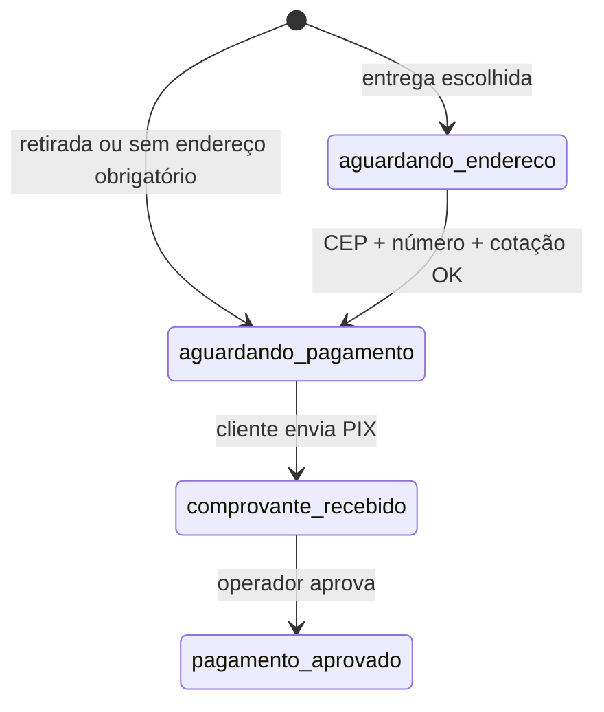

# Catálogo IA — Compra por WhatsApp/WebChat — Handoff para análise (GPT)

**Versão documentada:** `2.17.55` · **Produção base:** `2.17.46` (`0b655f9`) → evoluções `2.17.48`–`2.17.55`  
**Marca:** RadarChat · **App:** `https://app.radarchat.com.br`  
**Última revisão:** 2026-07-01

Documento para outro modelo/agente auditar o que existe, o que foi melhorado e como o fluxo deve se comportar.  
Doc operacional: [`docs/CATALOGO-PIX-PEDIDOS.md`](../CATALOGO-PIX-PEDIDOS.md).

---

## 1. Problema original (teste WhatsApp pós-2.17.46)

| # | Sintoma | Causa raiz identificada |
|---|---------|-------------------------|
| 1 | Loop *"Qual produto você gostaria de adquirir?"* sem produto cadastrado | Fallback genérico em `buildPurchaseRecoveryReply`; catálogo vazio não tinha mensagem honesta |
| 2 | Typo/inexistente sem sugestão | `guessProductFromText` só substring exata; sem similaridade |
| 3 | *"entregue"* / *"entrega"* não avançava | Atalho de oferta bloqueava fulfillment; pedido não criado ou resposta só via envio automático (silêncio) |
| 4 | Repetir *"zaad"* reiniciava oferta | `tryCatalogPurchaseOfferShortCircuit` re-ofertava sem checar oferta pendente |
| 5 | Saudação abria catálogo | `looksLikeCatalogProductNameQuery("ola boa tarde")` = true (2.17.48–49) |
| 6 | PIX sem produto válido | `shouldOpenPixOrderFlow` exigia palavras no contexto; corrigido com `catalogOfferProductName` + `structured.shouldCreateCatalogOrder` |
| 7 | *entregue* mandava PIX sem CEP (2.17.53 QA) | `processFulfillmentChoice` enviava PIX em `aguardando_pagamento`; produto `requiresDeliveryAddress: false` bloqueava perfil `retail_delivery` — corrigido **2.17.54** |
| 8 | *sim* abria catálogo como produto | `looksLikeCatalogProductNameQuery('sim')` = true — corrigido **2.17.54** |
| 9 | Estoque *consulte* gerava PIX | `productStockIsZero` não cobria indefinido — `productStockAllowsPixPurchase` **2.17.54** |

---

## 2. Linha do tempo de versões

| Versão | Commit (aprox.) | Entrega |
|--------|-----------------|--------|
| **2.17.46** | `0b655f9` | Oferta padronizada, perfil comercial UI, `requireDeliveryAddress` default, bloqueio escalação comercial no fluxo catálogo |
| **2.17.48** | `dada81e` | Atalho fulfillment WA (`tryCatalogFulfillmentShortCircuit`), similaridade de título, consulta só pelo nome do produto |
| **2.17.49** | `17a5b64` | Paridade WebChat (`tryCatalogWebChatShortCircuit`) |
| **2.17.50** | `bfef0a1` | Fix saudação não abre catálogo; entrega sempre responde CEP via `sendAiReply`; pedido forçado em fulfillment |
| **2.17.51** | `715a7eb` | Catálogo vazio honesto; sugestões com preço/estoque; doc handoff |
| **2.17.52** | (este pacote) | Fuzzy ambíguo exige confirmação; preço obrigatório; doc conclusão produção |
| **2.17.54** | `f0f1d45` | Entrega antes PIX; estoque indefinido; `sim`≠produto; perguntas taxa/endereço; modos retirada/entrega |
| **2.17.55** | — | UX Produtos; WhatsApps operacionais (loja/conferência/entregadores bloqueado); dashboard e tabelas |
| **2.17.58** | (local) | Hotfix QA produção: PIX retirada único; retirada exige endereço; endereço livre/pin; fallback contextual — `RADARCHAT-HOTFIX-CATALOGO-WA-ENDERECO-PIX-2.17.58.md` |

---

## 3. Arquitetura do fluxo (WhatsApp)

```
Inbound WA → AiConversationService.handleAiInbound()
  ├─ tryCatalogAddressShortCircuit          (CEP / número com pedido aguardando_endereco)
  ├─ tryCatalogFulfillmentShortCircuit      (retirar | entrega | entregue | delivery …)
  ├─ tryCatalogPurchaseOfferShortCircuit    (intenção compra OU nome de produto)
  ├─ isKbRequiredFactualInquiry → KB
  └─ LLM → processAiCatalogTurn()           (pedido, frete, PIX pós-LLM)
```

**Ordem importa:** fulfillment **antes** da oferta de compra.

### WebChat (paridade desde 2.17.49)

`WebChatAiService.generateVisitorReply()` → `tryCatalogWebChatShortCircuit()` com mesma lógica, antes do LLM.

---

## 4. Arquivos principais

| Arquivo | Responsabilidade |
|---------|------------------|
| `src/services/ai/AiConversationService.ts` | Atalhos WA: endereço, fulfillment, oferta, recovery |
| `src/services/webchat/WebChatAiService.ts` | Atalho catálogo WebChat |
| `src/services/catalog/CatalogSalesService.ts` | Pedidos, PIX, frete, mensagens, sugestões, fulfillment |
| `src/types/catalog-sales.ts` | Tipos, detecção, similaridade, mensagens padrão |
| `src/services/ai/AiEscalationService.ts` | `catalogSalesFlowActive` bloqueia escalação comercial |
| `src/services/web-dashboard/frontend/src/pages/menu/AiAtendimento.tsx` | UI perfil comercial + catálogo + PIX |
| `src/models/CatalogSalesOrder.ts` | Pedido (`aguardando_endereco`, `aguardando_pagamento`, …) |
| `src/models/AiKnowledgeBase.ts` | Produtos categoria **"Produtos e estoque"** |

---

## 5. Métodos e funções (referência rápida)

### 5.1 `src/types/catalog-sales.ts`

| Símbolo | Tipo | Função |
|---------|------|--------|
| `looksLikeCatalogProductNameQuery(text)` | fn | Mensagem curta parece nome de produto (exclui saudação, entrega, 3+ palavras) |
| `isAwaitingCatalogFulfillmentChoice(lastAssistant)` | fn | Última msg do bot foi oferta *retirar/entregue* |
| `isCatalogPurchaseOfferMessage(text)` | fn | Detecta oferta padronizada |
| `extractProductNameFromCatalogOffer(text)` | fn | Extrai título do produto da oferta |
| `buildFulfillmentReminderReply(product, name?)` | fn | *"prefere retirar ou entregue?"* |
| `detectDeliveryFulfillmentChoice(text)` | fn | entrega, entregue, delivery, mandar entregar, quero receber, … |
| `detectPickupFulfillmentChoice(text)` | fn | retirar, retirada, buscar, … |
| `catalogTitleSimilarity(a, b)` | fn | Similaridade 0–1 (Levenshtein + substring) |
| `extractCatalogProductQueryToken(text)` | fn | Token provável de produto na frase |
| `formatCatalogProductSuggestionLine(title, price, stock)` | fn | `*ZAAd* — R$ 150 — 2 un.` |
| `buildEmptyCatalogReply(firstName?)` | fn | Catálogo vazio — sem loop |
| `shouldOpenPixOrderFlow(opts)` | fn | Abre pedido PIX (incl. `catalogOfferProductName`) |
| `CATALOG_DELIVERY_CEP_REQUEST_MESSAGE` | const | Texto pedido de CEP |
| `CATALOG_EMPTY_REPLY_SUFFIX` | const | Texto catálogo vazio |

### 5.2 `CatalogSalesService`

| Método | Função |
|--------|--------|
| `loadCompanyConfig(clientId)` | `Organization.catalogSales` normalizado |
| `buildCatalogPurchaseOfferReply({...})` | Oferta padronizada preço/estoque/retirar-entregue |
| `buildPurchaseOfferForInquiry({...})` | Resolve produto → oferta ou sem estoque |
| `resolveProductForPurchaseContext({...})` | Produto por texto + thread + última oferta |
| `buildProductNotFoundReply({...})` | Similar (até 3) com preço/estoque ou lista ou vazio |
| `buildCatalogProductListReply(clientId)` | Lista até 8 produtos com preço/estoque |
| `processFulfillmentChoice({...})` | Retirada/entrega sem LLM → pedido + resposta |
| `processAiCatalogTurn({...})` | Incremental CEP, criar pedido, pickup automático, cotação |
| `maybeCreateOrderFromAiTurn({...})` | Cria `CatalogSalesOrder` se regras PIX OK |
| `findActiveOrderForConversation(clientId, convId)` | Pedido ativo na conversa |
| `sendPickupFulfillmentToCustomer(order, cfg)` | Retirada + PIX (automático) |
| `buildPurchaseRecoveryReply({...})` | Recovery quando LLM falha em compra |
| `guessProductFromText` (private) | Match substring + exato + similar ≥0.78 |
| `findSimilarCatalogProducts` (private) | Top N similares ≥0.68 |
| `notifyInternalWhatsapp` | Alerta interno **no comprovante** (texto com endereço) |

### 5.3 `AiConversationService` (privados)

| Método | Função |
|--------|--------|
| `tryCatalogAddressShortCircuit` | CEP/número → `processAiCatalogTurn` |
| `tryCatalogFulfillmentShortCircuit` | Entrega/retirada → `processFulfillmentChoice` + `sendAiReply` |
| `tryCatalogPurchaseOfferShortCircuit` | Oferta / not found / lembrete fulfillment |
| `recoverFromAiFailure` | Fallback; fulfillment e `buildPurchaseRecoveryReply` |

---

## 6. Comportamento esperado (especificação funcional)

### 6.1 Catálogo vazio

- **Resposta:** `buildEmptyCatalogReply` — *"no momento não encontrei produtos cadastrados… digite atendente"*
- **Não:** loop, pedido, PIX, inventar preço/estoque

### 6.2 Produto não encontrado (catálogo com itens)

- Até **3 sugestões** com `formatCatalogProductSuggestionLine` (preço + estoque reais da KB)
- **Não** abre PIX até confirmação/escolha explícita

### 6.3 Produto encontrado com estoque

- Oferta: *"Olá, {nome}! O produto **X** está disponível por R$ … e temos N… prefere **retirar** ou **entregue**?"*
- Contexto via `extractProductNameFromCatalogOffer` + `CatalogSalesOrder` ativo

### 6.4 Fulfillment

| Cliente diz | Ação |
|-------------|------|
| retirar, retirada, buscar | Pedido `aguardando_pagamento` + PIX retirada |
| entrega, entregue, delivery, mandar entregar, quero receber | Pedido `aguardando_endereco` + pedir **CEP** |
| Repete nome do produto após oferta | `buildFulfillmentReminderReply` (não re-oferta) |

### 6.5 Estoque zero

- `buildOutOfStockReply` — indisponível + similares com estoque
- **Não** cria pedido nem PIX (`maybeCreateOrderFromAiTurn` retorna null)

### 6.6 Configuração obrigatória (painel)

1. **IA Atendimento** → Perfil: **Varejo com entrega**
2. **Ativar pedidos via IA/catálogo** (`catalogSales.enabled`)
3. **PIX** configurado se fluxo PIX (`pixEnabled`, instruções)
4. Produto na KB categoria **"Produtos e estoque"**, `active: true`
5. `autoCreateOrderOnPurchase` — se false, fulfillment ainda força pedido (`forceFulfillmentOrder`)

### 6.7 Empresa sem catálogo

- `cfg.enabled === false` → todos os atalhos retornam `false`; fluxo IA normal.

---

## 7. Segurança / o que NÃO fazer

- Não expor PIX/chaves/tokens em logs ou respostas inventadas pela KB (oferta vem do servidor).
- `sanitizeAiReplyStripPixBeforeAddress` enquanto `aguardando_endereco`.
- `catalogSalesFlowActive` evita escalação comercial no meio da compra.
- Notificação interna WA: só texto no **comprovante**; endereço em texto; **sem pin GPS** para entregador (lacuna conhecida).

---

## 8. Testes automatizados

| Arquivo | Cobertura |
|---------|-----------|
| `src/types/__tests__/catalog-sales.test.ts` | Detecção entrega/retirada, similaridade, saudação, oferta, PIX flow, sugestão formatada, catálogo vazio |

**Rodar:**

```bash
npx jest src/types/__tests__/catalog-sales.test.ts
npm run build
npm run build --prefix src/services/web-dashboard/frontend
npm run pre-push:gate
```

**Ainda sem teste de integração** com Mongo mock para `CatalogSalesService` completo — candidato futuro.

---

## 9. QA manual (checklist produção)

- [ ] Perfil **Varejo com entrega** + catálogo + PIX ativos
- [ ] **Catálogo vazio:** *"quero comprar algo"* → mensagem honesta, sem loop
- [ ] Produto **ZAAd** R$ + estoque cadastrados
- [ ] *"quero comprar zaad"* → oferta retirar/entregue
- [ ] *"entregue"* / *"entrega"* → pede CEP
- [ ] *"retirar"* → PIX retirada
- [ ] *"zad"* → sugestão ZAAd com preço
- [ ] Estoque **0** → indisponível + alternativas
- [ ] *"ola boa tarde"* → saudação IA normal (não lista produtos)
- [ ] Repetir *"zaad"* após oferta → lembrete retirar/entregue

---

## 10. Lacunas conhecidas (não escopo 2.17.51)

1. **Entregador:** não envia pin/localização GPS para outro número — só texto no alerta de comprovante.
2. **Notificação interna:** disparada no comprovante, não ao confirmar endereço.
3. **Testes E2E CI** podem falhar (smoke Playwright) sem bloquear Deploy.
4. **Fuzzy match** em `guessProductFromText` (≥0.78) pode ofertar produto similar sem confirmação explícita — avaliar se deve só sugerir.

---

## 11. Diagrama de estados do pedido



---

## 12. Prompt sugerido para outro GPT

```
Analise o repositório RadarChat (radarzapv2) focando no fluxo de catálogo IA.
Leia: docs/concluidos/CATALOGO-IA-COMPRA-HANDOFF-GPT.md e docs/CATALOGO-PIX-PEDIDOS.md.
Audite: AiConversationService (atalhos), CatalogSalesService (pedido/PIX), catalog-sales.ts (detecções).
Valide se os 8 cenários da seção 6 estão cobertos no código atual (versão package.json).
Liste regressões, lacunas e sugestões sem alterar contratos de API ou segredos.
```

---

## 13. Changelog interno deste pacote

Ver `docs/CHANGELOG.md` **[2.17.51]** e `docs/SISTEMA-REGISTRO.md`.
